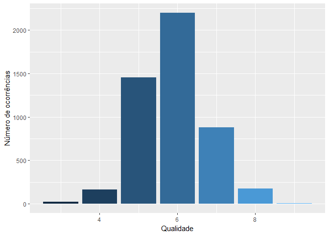

Análise da qualidade de vinhos
================
Alef Tenório; Alex Pereira; Guilherme A. Leite & Raphael Prates
2019-01-26

-   [Parte I - Análise Exploratória de dados](#parte-i---análise-exploratória-de-dados)
    -   [Descrição das variáveis](#descrição-das-variáveis)
        -   [Dimensão do dataset](#dimensão-do-dataset)
        -   [Integridade dos dados](#integridade-dos-dados)
        -   [Característica de cada tipo de vinho](#característica-de-cada-tipo-de-vinho)
        -   [Remoção de outliers](#remoção-de-outliers)
        -   [Correlação](#correlação)
        -   [Componentes principais](#componentes-principais)
-   [Parte II - Técnicas quantitativas](#parte-ii---técnicas-quantitativas)
    -   [Regresão Linear](#regresão-linear)
        -   [Subset para regressão linear](#subset-para-regressão-linear)
        -   [Componentes principais com regressão linear](#componentes-principais-com-regressão-linear)
        -   [Testando os modelos](#testando-os-modelos)
    -   [Árvore de regressão](#árvore-de-regressão)
    -   [Conclusão: regressão linear e árvore de regressão](#conclusão-regressão-linear-e-árvore-de-regressão)
-   [Parte III - Técnicas de discriminação](#parte-iii---técnicas-de-discriminação)
    -   [Regressão Logística](#regressão-logística)
    -   [Árvore de Decisão](#árvore-de-decisão)
    -   [Conclusão: regressão logística e árvore de decisão](#conclusão-regressão-logística-e-árvore-de-decisão)
-   [Parte IV - Modelos alternativos](#parte-iv---modelos-alternativos)
    -   [Técnicas supervisionadas que poderiam ser usadas](#técnicas-supervisionadas-que-poderiam-ser-usadas)
        -   [Gaussian Naive Bayes](#gaussian-naive-bayes)
        -   [Random forest](#random-forest)
    -   [Técnicas não supervisionadas que poderiam ser usadas](#técnicas-não-supervisionadas-que-poderiam-ser-usadas)
        -   [Generative Adversarial Networks (GANs)](#generative-adversarial-networks-gans)
        -   [K-means](#k-means)

Parte I - Análise Exploratória de dados
=======================================

Descrição das variáveis
-----------------------

Para começar nossa análise vamos identificar as variáveis para entender o que elas podem significar no contexto da composição de um vinho.

``` r
str(wine_dset)
```

    ## 'data.frame':    6497 obs. of  14 variables:
    ##  $ id_vinho          : int  1 2 3 4 5 6 7 8 9 10 ...
    ##  $ fixedacidity      : num  6.6 6.7 10.6 5.4 6.7 6.8 6.6 7.2 5.1 6.2 ...
    ##  $ volatileacidity   : num  0.24 0.34 0.31 0.18 0.3 0.5 0.61 0.66 0.26 0.22 ...
    ##  $ citricacid        : num  0.35 0.43 0.49 0.24 0.44 0.11 0 0.33 0.33 0.2 ...
    ##  $ residualsugar     : num  7.7 1.6 2.2 4.8 18.8 ...
    ##  $ chlorides         : num  0.031 0.041 0.063 0.041 0.057 0.075 0.069 0.068 0.027 0.035 ...
    ##  $ freesulfurdioxide : num  36 29 18 30 65 16 4 34 46 58 ...
    ##  $ totalsulfurdioxide: num  135 114 40 113 224 49 8 102 113 184 ...
    ##  $ density           : num  0.994 0.99 0.998 0.994 1 ...
    ##  $ pH                : num  3.19 3.23 3.14 3.42 3.11 3.36 3.33 3.27 3.35 3.11 ...
    ##  $ sulphates         : num  0.37 0.44 0.51 0.4 0.53 0.79 0.37 0.78 0.43 0.53 ...
    ##  $ alcohol           : num  10.5 12.6 9.8 9.4 9.1 9.5 10.4 12.8 11.4 9 ...
    ##  $ quality           : int  5 6 6 6 5 5 4 6 7 6 ...
    ##  $ Vinho             : Factor w/ 2 levels "RED","WHITE": 2 2 1 2 2 1 1 1 2 2 ...

**PH:** vinhos são naturalmente ácidos, com a maioria indo de 2,8 a 4,0. Os níveis de pH estão intrinsecamente ligados ao estilo e qualidade dos vinhos. O pH relativamente baixo, na faixa de 3,1 a 3,4, parece ser pré-requisito para a produção de vinhos de alta qualidade com solidez.

**Acidez Volátil:** é um componente do vinho que tipicamente cresce conforme o vinho envelhece e, em quando atinge um nível elevado, é responsável pelo aroma de vinagre. É o resultado da falta de cuidados durante a vinificação.

**Acidez Fixa:** acidez é uma das características básica que tem uma contribuição relevante para o sabor, frescura, equilíbrio e capacidade de conservação dos vinhos. Acidez Fixa é a diferença entre acidez total do vinho e sua acidez volátil.

**Ácido Cítrico:** nos vinhos o ácido cítrico tem pouca ou nenhuma presença. Nos vinhos tintos desaparece devido à ação de bactérias láticas (fermentação malolática). Sensorialmente é fresco, porém em alguns casos pode apresentar um leve final amargo.

**Dióxido de Enxofre Livre:** as atividade antioxidásica do dióxido de enxofre bloqueia a ação de enzimas oxidantes, principalmente no início do processo de elaboração, evitando reações de oxidação e o consequentemente o escurecimento do vinho. O excesso de dióxido de enxofre livre tem um grande impacto no sabor, deixando-o mais amargo e com uma sensação mais metálica.

**Dióxido de Enxofre Total:** quanto mais dióxido de enxofre total estiver disponível, mais estável será o dióxido de enxofre livre.

**Açúcar Residual:** no processo de fermentação do vinho a levedura vai transformando o açúcar da uva em álcool. Por isso que, em teoria, quanto mais açúcar houver na uva, mais álcool haverá no vinho. Porem nem todo o açúcar é transformado em alcool, e o açúcar que resta no final do processo de fermentação é conhecido como açúcar residual.

**Cloretos:** os vinhos possuem em sua composição diversos produtos enológicos, sais e ácidos. Estes sais influenciam diretamente em sua qualidade.

**Densidade:** define a leveza do vinhos, e pode ser caracterizado pelo tipo da uva ou por técnicas usadas na vinificação que podem ser determinantes na concentração da bebida.

**Álcool:** essa é uma característica que causa controversa entre sommeliers. Embora há vinhos premiados com uma porcentagem maior de álcool, outros defendem que para o vinho ser de qualidade tem que ser inferior a 14% de álcool.

**Sulfatos:** os sulfatos também tem um papel de conservantes nos vinhos e ajudam na extração dos compostos fenólicos do vinho, responsáveis pela concentração de cor e taninos.

**Qualidade:** uma infidade de aspectos influenciam na qualidade dos vinhos, desde aspectos como o nivel de oxidação, até a contaminação da rolha. No dataset a qualidade máxima é uma escala inteira entre 0 (menor qualidade) e 10 (maior qualidade).

**Vinho:** há inúmeros tipos de vinho (ex: tintos, brancos, roses, doces e espumantes), porém nossos dados contém apenas dois tipos: brancos e tintos.

Links acessados para fundamentação teórica:

-   <https://www.extension.iastate.edu/wine/white-wine-production>
-   <https://www.extension.iastate.edu/wine/total-sulfur-dioxide-why-it-matters-too>
-   <https://grapesandwine.cals.cornell.edu/sites/grapesandwine.cals.cornell.edu/files/shared/documents/Research-Focus-2011-3.pdf>
-   <https://www.whichwinery.com/ask-the-somm/breaking-down-booze-wine-alcohol-levels-explored/>

### Dimensão do dataset

``` r
wine_dset %>% 
  group_by(Vinho) %>% 
  count()
```

    ## # A tibble: 2 x 2
    ## # Groups:   Vinho [2]
    ##   Vinho     n
    ##   <fct> <int>
    ## 1 RED    1599
    ## 2 WHITE  4898

A quantidade de dados para os vinhos brancos é aproximadamente 3 vezes maior que o vinho tinto.

### Integridade dos dados

Antes de qualquer análise, vamos conferir se nosso dataset não apresenta valores faltantes:

``` r
wine_white_dset <- 
  wine_dset %>%
  filter(Vinho == 'WHITE')

wine_red_dset <- 
  wine_dset %>% 
  filter(Vinho == 'RED')

sum(is.na(wine_white_dset))
```

    ## [1] 0

``` r
sum(is.na(wine_red_dset))
```

    ## [1] 0

Como as somas dos valores *NA*s, tanto para o vinho tinto quanto para o branco, podemos afirmar que **não há dados faltantes.** Dessa forma podemos continuar sem precisar substituir ou remover os valores iguais a *NA*.

### Característica de cada tipo de vinho

O vinho branco e tinto apresentam características diferentes que definem se ele é bom ou ruim. Vamos dar uma olhada nos dados pra cada característica:

**Vinho Branco**

``` r
summary(wine_white_dset)
```

    ##     id_vinho     fixedacidity    volatileacidity    citricacid    
    ##  Min.   :   1   Min.   : 3.800   Min.   :0.0800   Min.   :0.0000  
    ##  1st Qu.:1650   1st Qu.: 6.300   1st Qu.:0.2100   1st Qu.:0.2700  
    ##  Median :3310   Median : 6.800   Median :0.2600   Median :0.3200  
    ##  Mean   :3284   Mean   : 6.855   Mean   :0.2782   Mean   :0.3342  
    ##  3rd Qu.:4932   3rd Qu.: 7.300   3rd Qu.:0.3200   3rd Qu.:0.3900  
    ##  Max.   :6497   Max.   :14.200   Max.   :1.1000   Max.   :1.6600  
    ##  residualsugar      chlorides       freesulfurdioxide totalsulfurdioxide
    ##  Min.   : 0.600   Min.   :0.00900   Min.   :  2.00    Min.   :  9.0     
    ##  1st Qu.: 1.700   1st Qu.:0.03600   1st Qu.: 23.00    1st Qu.:108.0     
    ##  Median : 5.200   Median :0.04300   Median : 34.00    Median :134.0     
    ##  Mean   : 6.387   Mean   :0.04577   Mean   : 35.31    Mean   :138.4     
    ##  3rd Qu.: 9.900   3rd Qu.:0.05000   3rd Qu.: 46.00    3rd Qu.:167.0     
    ##  Max.   :45.800   Max.   :0.34600   Max.   :289.00    Max.   :440.0     
    ##     density             pH          sulphates         alcohol     
    ##  Min.   :0.9871   Min.   :2.720   Min.   :0.2200   Min.   : 8.00  
    ##  1st Qu.:0.9917   1st Qu.:3.090   1st Qu.:0.4100   1st Qu.: 9.50  
    ##  Median :0.9937   Median :3.180   Median :0.4700   Median :10.40  
    ##  Mean   :0.9940   Mean   :3.188   Mean   :0.4898   Mean   :10.51  
    ##  3rd Qu.:0.9961   3rd Qu.:3.280   3rd Qu.:0.5500   3rd Qu.:11.40  
    ##  Max.   :1.0140   Max.   :3.820   Max.   :1.0800   Max.   :14.20  
    ##     quality        Vinho     
    ##  Min.   :3.000   RED  :   0  
    ##  1st Qu.:5.000   WHITE:4898  
    ##  Median :6.000               
    ##  Mean   :5.878               
    ##  3rd Qu.:6.000               
    ##  Max.   :9.000

**Vinho Tinto**

``` r
summary(wine_red_dset)
```

    ##     id_vinho     fixedacidity   volatileacidity    citricacid   
    ##  Min.   :   3   Min.   : 4.60   Min.   :0.1200   Min.   :0.000  
    ##  1st Qu.:1523   1st Qu.: 7.10   1st Qu.:0.3900   1st Qu.:0.090  
    ##  Median :3103   Median : 7.90   Median :0.5200   Median :0.260  
    ##  Mean   :3141   Mean   : 8.32   Mean   :0.5278   Mean   :0.271  
    ##  3rd Qu.:4690   3rd Qu.: 9.20   3rd Qu.:0.6400   3rd Qu.:0.420  
    ##  Max.   :6490   Max.   :15.90   Max.   :1.5800   Max.   :1.000  
    ##  residualsugar      chlorides       freesulfurdioxide totalsulfurdioxide
    ##  Min.   : 0.900   Min.   :0.01200   Min.   : 1.00     Min.   :  6.00    
    ##  1st Qu.: 1.900   1st Qu.:0.07000   1st Qu.: 7.00     1st Qu.: 22.00    
    ##  Median : 2.200   Median :0.07900   Median :14.00     Median : 38.00    
    ##  Mean   : 2.539   Mean   :0.08747   Mean   :15.87     Mean   : 46.47    
    ##  3rd Qu.: 2.600   3rd Qu.:0.09000   3rd Qu.:21.00     3rd Qu.: 62.00    
    ##  Max.   :15.500   Max.   :0.61100   Max.   :72.00     Max.   :289.00    
    ##     density             pH          sulphates         alcohol       
    ##  Min.   :0.9901   Min.   :2.740   Min.   :0.3300   Min.   : 0.9567  
    ##  1st Qu.:0.9956   1st Qu.:3.210   1st Qu.:0.5500   1st Qu.: 9.5000  
    ##  Median :0.9968   Median :3.310   Median :0.6200   Median :10.2000  
    ##  Mean   :0.9967   Mean   :3.311   Mean   :0.6581   Mean   :10.4001  
    ##  3rd Qu.:0.9978   3rd Qu.:3.400   3rd Qu.:0.7300   3rd Qu.:11.1000  
    ##  Max.   :1.0037   Max.   :4.010   Max.   :2.0000   Max.   :14.9000  
    ##     quality        Vinho     
    ##  Min.   :3.000   RED  :1599  
    ##  1st Qu.:5.000   WHITE:   0  
    ##  Median :6.000               
    ##  Mean   :5.636               
    ##  3rd Qu.:6.000               
    ##  Max.   :8.000

#### Diferença da mediana das características por tipo de vinho

Trabalharemos com os valores das medianas, ao invés das médias, porque as medianas não sofrem o impacto que as médias sofreria devido a presença de outliers. Explorando esses dados é possível ter um overview de como essas característica estão organizadas pelo dataset e identificar o que difere um vinho tinto do branco.

``` r
# Vinho Tinto
median_red_dset <-  sapply(select(wine_red_dset, -c(Vinho, id_vinho, quality)), median)
median_red_dset <- as.data.frame(median_red_dset)
median_red_dset <- rownames_to_column(median_red_dset) %>% 
  rename(Mediana = median_red_dset, Caracteristica = rowname) 

# Vinho Branco
median_white_dset <-  sapply(select(wine_white_dset, -c(Vinho, id_vinho, quality)),median)
median_white_dset <- as.data.frame(median_white_dset)
median_white_dset <- rownames_to_column(median_white_dset) %>% 
  rename(Mediana = median_white_dset, Caracteristica = rowname) 

# Diferenca
mediana_diferenca <- data.frame(
  Caracteristica = median_white_dset$Caracteristica,
  Diferenca.Mediana = abs(median_white_dset$Mediana - median_red_dset$Mediana)
)

top_n(arrange(mediana_diferenca, desc(mediana_diferenca$Diferenca.Mediana)), dim(arrange(mediana_diferenca, desc(mediana_diferenca$Diferenca.Mediana)))[1])
```

    ##        Caracteristica Diferenca.Mediana
    ## 1  totalsulfurdioxide          96.00000
    ## 2   freesulfurdioxide          20.00000
    ## 3       residualsugar           3.00000
    ## 4        fixedacidity           1.10000
    ## 5     volatileacidity           0.26000
    ## 6             alcohol           0.20000
    ## 7           sulphates           0.15000
    ## 8                  pH           0.13000
    ## 9          citricacid           0.06000
    ## 10          chlorides           0.03600
    ## 11            density           0.00301

Vamos utilizar a análise gráfica para reforçar a visualização dos valores já obtidos na função *summary* (a visualização gráfica por histogramas nos auxilia também na detecção de outliers):

#### Diagrama de caixa de cada característica

``` r
par (mfrow=c(3,4))
nomesColuna <- colnames(wine_dset)
nomesColuna <- nomesColuna[-c(which(nomesColuna == "id_vinho"),which(nomesColuna == "Vinho" ))]
for (coluna in nomesColuna) {
  ggplot(wine_dset, aes(x=Vinho, y=coluna, fill=Vinho)) + 
    geom_boxplot() +
    scale_fill_manual(breaks = c("RED", "WHITE"), 
                      values=c("red3", "khaki"))
}
```

``` r
multiplot <- function(..., plotlist=NULL, file, cols=1, layout=NULL) {
  library(grid)

  # Make a list from the ... arguments and plotlist
  plots <- c(list(...), plotlist)

  numPlots = length(plots)

  # If layout is NULL, then use 'cols' to determine layout
  if (is.null(layout)) {
    # Make the panel
    # ncol: Number of columns of plots
    # nrow: Number of rows needed, calculated from # of cols
    layout <- matrix(seq(1, cols * ceiling(numPlots/cols)),
                    ncol = cols, nrow = ceiling(numPlots/cols))
  }

 if (numPlots==1) {
    print(plots[[1]])

  } else {
    # Set up the page
    grid.newpage()
    pushViewport(viewport(layout = grid.layout(nrow(layout), ncol(layout))))

    # Make each plot, in the correct location
    for (i in 1:numPlots) {
      # Get the i,j matrix positions of the regions that contain this subplot
      matchidx <- as.data.frame(which(layout == i, arr.ind = TRUE))

      print(plots[[i]], vp = viewport(layout.pos.row = matchidx$row,
                                      layout.pos.col = matchidx$col))
    }
  }
}

# boxplot(fixedacidity, main='fixedacidity')
g1 <- ggplot(wine_dset, aes(x=Vinho, y=fixedacidity, fill=Vinho)) + 
  geom_boxplot() +
  theme(legend.position="none") +
  scale_fill_manual(breaks = c("RED", "WHITE"), 
                    values=c("red3", "khaki"))

# boxplot(volatileacidity , main='volatileacidity')
g2 <- ggplot(wine_dset, aes(x=Vinho, y=volatileacidity, fill=Vinho)) + 
  geom_boxplot() +
  theme(legend.position="none") +
  scale_fill_manual(breaks = c("RED", "WHITE"), 
                    values=c("red3", "khaki"))

# boxplot(citricacid , main='citricacid')
g3 <- ggplot(wine_dset, aes(x=Vinho, y=citricacid, fill=Vinho)) + 
  geom_boxplot() +
  theme(legend.position="none") +
  theme(legend.position="none") +
  scale_fill_manual(breaks = c("RED", "WHITE"), 
                    values=c("red3", "khaki"))

# boxplot(residualsugar, main='residualsugar')
g4 <- ggplot(wine_dset, aes(x=Vinho, y=residualsugar, fill=Vinho)) + 
  geom_boxplot() +
  theme(legend.position="none") +
  scale_fill_manual(breaks = c("RED", "WHITE"), 
                    values=c("red3", "khaki"))

# boxplot(chlorides, main='chlorides')
g5 <- ggplot(wine_dset, aes(x=Vinho, y=chlorides, fill=Vinho)) + 
  geom_boxplot() +
  theme(legend.position="none") +
  scale_fill_manual(breaks = c("RED", "WHITE"), 
                    values=c("red3", "khaki"))

# boxplot(freesulfurdioxide, main='freesulfurdioxide')
g6 <- ggplot(wine_dset, aes(x=Vinho, y=freesulfurdioxide, fill=Vinho)) + 
  geom_boxplot() +
  theme(legend.position="none") +
  scale_fill_manual(breaks = c("RED", "WHITE"), 
                    values=c("red3", "khaki"))

# boxplot(totalsulfurdioxide, main='totalsulfurdioxide')
g7 <- ggplot(wine_dset, aes(x=Vinho, y=totalsulfurdioxide, fill=Vinho)) + 
  geom_boxplot() +
  theme(legend.position="none") +
  scale_fill_manual(breaks = c("RED", "WHITE"), 
                    values=c("red3", "khaki"))

# boxplot(density, main='density')
g8 <- ggplot(wine_dset, aes(x=Vinho, y=density, fill=Vinho)) + 
  geom_boxplot() +
  theme(legend.position="none") +
  scale_fill_manual(breaks = c("RED", "WHITE"), 
                    values=c("red3", "khaki"))

# boxplot(pH, main='pH')
g9 <- ggplot(wine_dset, aes(x=Vinho, y=pH, fill=Vinho)) + 
  geom_boxplot() +
  theme(legend.position="none") +
  scale_fill_manual(breaks = c("RED", "WHITE"), 
                    values=c("red3", "khaki"))

# boxplot(sulphates, main='sulphates')
g10 <- ggplot(wine_dset, aes(x=Vinho, y=sulphates, fill=Vinho)) + 
  geom_boxplot() +
  theme(legend.position="none") +
  scale_fill_manual(breaks = c("RED", "WHITE"), 
                    values=c("red3", "khaki"))

# boxplot(alcohol, main='alcohol')
g11 <- ggplot(wine_dset, aes(x=Vinho, y=alcohol, fill=Vinho)) + 
  geom_boxplot() +
  theme(legend.position="none") +
  scale_fill_manual(breaks = c("RED", "WHITE"), 
                    values=c("red3", "khaki"))

# boxplot(Vinhos$quality, main='quality')
g12 <- ggplot(wine_dset, aes(x=Vinho, y=quality, fill=Vinho)) + 
  geom_boxplot() +
  theme(legend.position="none") +
  scale_fill_manual(breaks = c("RED", "WHITE"), 
                    values=c("red3", "khaki"))

layout <- matrix(c(1,2,3,4,5,6,7,8,9,10,11,12),4,3,byrow=TRUE)
multiplot(g1, g2, g3, g4, g5, g6, g7, g8, g9 ,g10, g11, g12, layout=layout)
```

 Após a análise gráfica ficou ainda mais clara a diferença entre cada tipo de vinho (tinto ou branco), portanto, vamos selecionar somente um tipo de vinho para a criação de um modelo preditivo coerente. Além disso, como o número de dados pros vinhos brancos é bem maior do que para os tintos (aprox. 3 vezes maior), utilizaremos os dados que oferecem mais amostras pra treinar e validar nosso modelo.

Antes de prosseguirmos para a parte de remoção de outliers e a regressão linear, a variável o *freesulfurdioxide* chamou a atenção desde o tópico "Descrição dos Dados" por sua descrição dar indícios que este valor está relacionado ao sabor e, consequentemente, a qualidade do vinho. Testando esta relação:

``` r
wine_dset %>%
  group_by(quality, freesulfurdioxide) %>% 
  ggplot(aes(factor(quality), freesulfurdioxide, color = quality)) +
  geom_boxplot() +
  coord_cartesian(ylim = c(0, 150)) +
  theme(legend.position = "none") +
  facet_wrap(~Vinho ) +
  labs(y = "Dióxido de enxofre", x = "Qualidade")
```


Embora os vinhos de maior qualidade apresentam um baixo valor de dióxido de enxofre livre, a relação dos outros valores com qualidade se mostrou insuficiente para determinar se o vinho é bom ou não, ou seja, outras características correlacionadas com o dióxido de enxofre livre devem explicar melhor a qualidade.

#### Histograma da variável target *Qualidade*

``` r
wine_white_dset %>% group_by(quality) %>% 
  count() %>% 
  ggplot(aes(quality, n,fill = quality)) +
  geom_col() +
  theme(legend.position = "none") +
   labs(x = "Qualidade", y = "Número de ocorrências")
```



A maioria dos vinhos brancos apresenta a qualidade entre 5 e 7, sendo a nota 6 o valor mais frequente.

### Remoção de outliers

Com os diagramas de caixa foi possível identificar também a existência de outliers nos dados pois há pontos que estão acima do limite da *upper fence* ou abaixo da *lower fence*. Esses limites (lower e upper) são calculados utilizando a seguinte relação:

***Upper fence***:

upper\_fence = 3º Quartil + 1,5 \* Amplitude inter-quartil

***Lower fence***:

lower\_fence = 1º Quartil - 1,5 \* Amplitude inter-quartil

Para evitar que esses outliers influenciem em nossos modelos,usaremos uma abordagem mais conservadora para não remover tantos dados que considera **outliers valores absolutos maiores que (média + ( 3 \* desvio padrão)):**

``` r
wine_white_dset <- wine_white_dset %>% 
  select(-c(Vinho, id_vinho))

for (col in colnames(wine_white_dset)[1:11]) {
  sd3 <- 3*sd(wine_white_dset[,col])
  idx <- which(wine_white_dset[,col] > mean(wine_white_dset[,col]) + sd3 | wine_white_dset[,col] < mean(wine_white_dset[,col]) - sd3)
  for (x in idx) {
    wine_white_dset[x,col] <- NA
  }
}

wine_white_dset <- na.omit(wine_white_dset)
```

### Correlação

``` r
whitedset_cor <- cor(wine_white_dset)
corrplot::corrplot(whitedset_cor, method="circle", order="hclust")
```


Pela matriz de correlação é perceptível como algumas variáveis se correlacionam mais com o restante do dataset do que as outras devido ao tamanho do círculo e da cor (azul para variáveis diretamente proporcionais e vermelho para inversamente proporcionais), por exemplo: *density*, *totalsufurdioxide*, *freesufurdioxide* e *alcohol*.

### Componentes principais

As características que possuem similaridade alta no nível da correlação podem trazer informações redundantes e aumentar a instabilidade dos modelos, por isso, usaremos a análise de componentes principais para combinar essas variáveis para formar componentes ortogonais (não relacionadas com os componentes anteriores).

``` r
# Removendo a variavel quality
white_dsetX <- wine_white_dset[,-12]

white_pcomp <- prcomp(white_dsetX, center = TRUE,scale = TRUE)
summary(white_pcomp)
```

    ## Importance of components:
    ##                           PC1    PC2    PC3     PC4    PC5     PC6     PC7
    ## Standard deviation     1.8581 1.2460 1.1067 1.02979 0.9839 0.86524 0.84762
    ## Proportion of Variance 0.3139 0.1411 0.1114 0.09641 0.0880 0.06806 0.06531
    ## Cumulative Proportion  0.3139 0.4550 0.5664 0.66278 0.7508 0.81884 0.88415
    ##                           PC8     PC9    PC10    PC11
    ## Standard deviation     0.7621 0.62730 0.53600 0.11309
    ## Proportion of Variance 0.0528 0.03577 0.02612 0.00116
    ## Cumulative Proportion  0.9369 0.97272 0.99884 1.00000

``` r
plot(white_pcomp, type = 'l', main = "Componentes Principais")
```


Observa-se pelo gráfico que usando os componentes principais 1 até 6, os componentes explicam 81,88% da variância dos dados. A medida que outros componentes principais são adicionados esse número aumenta. Na regressão linear voltaremos à análise dos componentes principais.

Parte II - Técnicas quantitativas
=================================

Regresão Linear
---------------

O objetivo desta sessão é criar um modelo de regressão linear para estimar o índice de qualidade dos vinhos. Após dividir o dataset entre dataset de treino e teste, traçamos uma regressão linear com todas variáveis para estimar a qualidade do vinho:

``` r
set.seed(2019)
prt <- 2/3

treino <- sample(1:NROW(wine_white_dset), as.integer(prt*NROW(wine_white_dset)))

trainData <- wine_white_dset[treino,]
testData  <- wine_white_dset[-treino,]

modeloBackWard <- lm(quality ~., data = trainData)
summary(modeloBackWard)
```

    ## 
    ## Call:
    ## lm(formula = quality ~ ., data = trainData)
    ## 
    ## Residuals:
    ##     Min      1Q  Median      3Q     Max 
    ## -3.4291 -0.5106 -0.0288  0.4625  3.0000 
    ## 
    ## Coefficients:
    ##                      Estimate Std. Error t value Pr(>|t|)    
    ## (Intercept)         2.243e+02  3.143e+01   7.137 1.19e-12 ***
    ## fixedacidity        1.516e-01  3.100e-02   4.890 1.06e-06 ***
    ## volatileacidity    -1.469e+00  1.644e-01  -8.933  < 2e-16 ***
    ## citricacid          1.579e-01  1.429e-01   1.105  0.26903    
    ## residualsugar       1.032e-01  1.166e-02   8.849  < 2e-16 ***
    ## chlorides          -4.373e+00  1.350e+00  -3.240  0.00121 ** 
    ## freesulfurdioxide   4.964e-03  1.180e-03   4.207 2.66e-05 ***
    ## totalsulfurdioxide  9.350e-05  5.037e-04   0.186  0.85275    
    ## density            -2.257e+02  3.185e+01  -7.085 1.72e-12 ***
    ## pH                  1.012e+00  1.483e-01   6.824 1.07e-11 ***
    ## sulphates           8.181e-01  1.372e-01   5.964 2.76e-09 ***
    ## alcohol             8.695e-02  3.916e-02   2.220  0.02648 *  
    ## ---
    ## Signif. codes:  0 '***' 0.001 '**' 0.01 '*' 0.05 '.' 0.1 ' ' 1
    ## 
    ## Residual standard error: 0.7346 on 2989 degrees of freedom
    ## Multiple R-squared:  0.2778, Adjusted R-squared:  0.2752 
    ## F-statistic: 104.5 on 11 and 2989 DF,  p-value: < 2.2e-16

Do *modeloBackWard* acima:

**Variáveis dependentes:** quality
**Variáveis independentes:** todas as outras

Os valores com asterisco são aqueles mais correlacionados com a variável *quality*. A coluna *Pr(&gt;|t|)* mostra o Teste T de Student, portanto, valores abaixo do p value igual a 0,05 são relevantes para a análise de acordo com a taxa escolhida (p = 5%). Como a maioria das variáveis possuem asterisco, iremos utilizar duas abordagens pra encontrar o melhor modelo usando menos variáveis para evitar informações redundantes:

-   Utilizar as bibliotecas *leaps* e *car* para encontrar o melhor subset pra regressão linear;
-   Utilizar as componentes principais no modelo de regressão linear.

### Subset para regressão linear

**Biblioteca Leaps e Car**

``` r
library(car)
library(leaps)

leaps <- regsubsets(quality~., data = trainData, nbest = 2, method = "exhaustive")
subsets(leaps, statistic = "bic", legend = FALSE, ylim=c(-950,-800), xlim=c(2,6.3))
```


    ##                    Abbreviation
    ## fixedacidity                 fx
    ## volatileacidity               v
    ## citricacid                   ct
    ## residualsugar                 r
    ## chlorides                    ch
    ## freesulfurdioxide            fr
    ## totalsulfurdioxide            t
    ## density                       d
    ## pH                            p
    ## sulphates                     s
    ## alcohol                       a

Usando somente 4 variáveis pra construir o modelo de regressão linear da qualidade, o gráfico acima mostra que a melhor escolha é a combinação *volatileacidity+residualsugar+freesulfurdioxide+alcohol* por ter o menor valor do critério de informação bayesiano (BIC). A ideia de pegar 4 variáveis é pra selecionar um número reduzido de itens pra construir o modelo, desta forma no mundo real nós conseguiríamos fazer um controle de qualidade usando testes químicos com menos substâncias, o que depreciaria o custo do processo.

``` r
modelo4 <- lm(quality ~volatileacidity+residualsugar+freesulfurdioxide+alcohol,
                     data = trainData)
summary(modelo4)
```

    ## 
    ## Call:
    ## lm(formula = quality ~ volatileacidity + residualsugar + freesulfurdioxide + 
    ##     alcohol, data = trainData)
    ## 
    ## Residuals:
    ##     Min      1Q  Median      3Q     Max 
    ## -3.3176 -0.5223 -0.0278  0.4630  3.0917 
    ## 
    ## Coefficients:
    ##                     Estimate Std. Error t value Pr(>|t|)    
    ## (Intercept)        2.0078829  0.1531226  13.113  < 2e-16 ***
    ## volatileacidity   -1.6560218  0.1601661 -10.339  < 2e-16 ***
    ## residualsugar      0.0209380  0.0032969   6.351 2.47e-10 ***
    ## freesulfurdioxide  0.0056434  0.0009559   5.904 3.96e-09 ***
    ## alcohol            0.3814995  0.0127655  29.885  < 2e-16 ***
    ## ---
    ## Signif. codes:  0 '***' 0.001 '**' 0.01 '*' 0.05 '.' 0.1 ' ' 1
    ## 
    ## Residual standard error: 0.7466 on 2996 degrees of freedom
    ## Multiple R-squared:  0.2521, Adjusted R-squared:  0.2511 
    ## F-statistic: 252.5 on 4 and 2996 DF,  p-value: < 2.2e-16

Do *modelo4* acima:

**Variáveis dependentes:** quality
**Variáveis independentes:** volatileacidity+residualsugar+freesulfurdioxide+alcohol
**R²:** 25,21%

O valor R² ainda é muito baixo para o modelo, 25,21%. Esse valor significa que o modelo explica somente a variação desta porcentagem dos dados do modelo.

E com 6 variáveis?

``` r
modelo6 <- lm(quality ~fixedacidity+volatileacidity+residualsugar+density+pH+sulphates,
                     data = trainData)
summary(modelo6)
```

    ## 
    ## Call:
    ## lm(formula = quality ~ fixedacidity + volatileacidity + residualsugar + 
    ##     density + pH + sulphates, data = trainData)
    ## 
    ## Residuals:
    ##     Min      1Q  Median      3Q     Max 
    ## -3.5292 -0.4992 -0.0466  0.4669  2.9784 
    ## 
    ## Coefficients:
    ##                   Estimate Std. Error t value Pr(>|t|)    
    ## (Intercept)      2.994e+02  9.523e+00  31.434  < 2e-16 ***
    ## fixedacidity     2.097e-01  2.064e-02  10.159  < 2e-16 ***
    ## volatileacidity -1.554e+00  1.577e-01  -9.854  < 2e-16 ***
    ## residualsugar    1.343e-01  5.651e-03  23.768  < 2e-16 ***
    ## density         -3.016e+02  9.784e+00 -30.828  < 2e-16 ***
    ## pH               1.262e+00  1.118e-01  11.283  < 2e-16 ***
    ## sulphates        9.656e-01  1.318e-01   7.329 2.97e-13 ***
    ## ---
    ## Signif. codes:  0 '***' 0.001 '**' 0.01 '*' 0.05 '.' 0.1 ' ' 1
    ## 
    ## Residual standard error: 0.7397 on 2994 degrees of freedom
    ## Multiple R-squared:  0.2664, Adjusted R-squared:  0.2649 
    ## F-statistic: 181.2 on 6 and 2994 DF,  p-value: < 2.2e-16

Do *modelo6* acima:

**Variáveis dependentes:** quality
**Variáveis independentes:** fixedacidity+volatileacidity+residualsugar+density+pH+sulphates
**R²:** 26,64%

O valor R² agora é de 26,64%, ou seja, o ganho na qualidade do modelo ao adicionar mais duas variáveis foi pouco significativo, portanto, **estes modelos de regressão linear não são adequados pra predição da qualidade.**

Tentaremos agora usar regressão linear com os componentes principais para aumentar R².

### Componentes principais com regressão linear

``` r
# Removendo a variavel quality e criando variavel com componentes principais para teste dset
white_dsetX <- trainData[,-12]
white_pcomp <- prcomp(white_dsetX, center = TRUE,scale = TRUE)


trainData2 <- trainData[,12]
# white_pcomp foi calculado na sessao de componentes principais
trainData2 <- cbind(trainData2,data.frame(white_pcomp$x))
testData2 <- testData[,12]
testData2 <- cbind(trainData2,data.frame(white_pcomp$x))
colnames(trainData2)[1] <- "quality"

modeloCP <- lm(quality ~., data = trainData2)
summary(modeloCP)
```

    ## 
    ## Call:
    ## lm(formula = quality ~ ., data = trainData2)
    ## 
    ## Residuals:
    ##     Min      1Q  Median      3Q     Max 
    ## -3.4291 -0.5106 -0.0288  0.4625  3.0000 
    ## 
    ## Coefficients:
    ##              Estimate Std. Error t value Pr(>|t|)    
    ## (Intercept)  5.916694   0.013409 441.256  < 2e-16 ***
    ## PC1         -0.145763   0.007316 -19.923  < 2e-16 ***
    ## PC2         -0.003905   0.010775  -0.362  0.71705    
    ## PC3         -0.171915   0.012002 -14.324  < 2e-16 ***
    ## PC4          0.156276   0.012878  12.135  < 2e-16 ***
    ## PC5         -0.037938   0.013701  -2.769  0.00566 ** 
    ## PC6         -0.127526   0.015296  -8.337  < 2e-16 ***
    ## PC7          0.044898   0.015663   2.866  0.00418 ** 
    ## PC8          0.008611   0.017537   0.491  0.62347    
    ## PC9         -0.346278   0.020980 -16.505  < 2e-16 ***
    ## PC10        -0.051897   0.024836  -2.090  0.03674 *  
    ## PC11        -0.726592   0.117969  -6.159 8.29e-10 ***
    ## ---
    ## Signif. codes:  0 '***' 0.001 '**' 0.01 '*' 0.05 '.' 0.1 ' ' 1
    ## 
    ## Residual standard error: 0.7346 on 2989 degrees of freedom
    ## Multiple R-squared:  0.2778, Adjusted R-squared:  0.2752 
    ## F-statistic: 104.5 on 11 and 2989 DF,  p-value: < 2.2e-16

Excluindo o *PC2* e o *PC8* do modelo por apresentarem um elevado *Pr(&gt;|t|)*:

``` r
modeloCP2 <- lm(quality ~PC1+PC3+PC4+PC5+PC6+PC7+PC9+PC10+PC11, data = trainData2)
summary(modeloCP2)
```

    ## 
    ## Call:
    ## lm(formula = quality ~ PC1 + PC3 + PC4 + PC5 + PC6 + PC7 + PC9 + 
    ##     PC10 + PC11, data = trainData2)
    ## 
    ## Residuals:
    ##     Min      1Q  Median      3Q     Max 
    ## -3.4349 -0.5116 -0.0312  0.4616  2.9947 
    ## 
    ## Coefficients:
    ##              Estimate Std. Error t value Pr(>|t|)    
    ## (Intercept)  5.916694   0.013405 441.376  < 2e-16 ***
    ## PC1         -0.145763   0.007314 -19.928  < 2e-16 ***
    ## PC3         -0.171915   0.011999 -14.328  < 2e-16 ***
    ## PC4          0.156276   0.012874  12.139  < 2e-16 ***
    ## PC5         -0.037938   0.013698  -2.770  0.00565 ** 
    ## PC6         -0.127526   0.015292  -8.339  < 2e-16 ***
    ## PC7          0.044898   0.015659   2.867  0.00417 ** 
    ## PC9         -0.346278   0.020975 -16.509  < 2e-16 ***
    ## PC10        -0.051897   0.024830  -2.090  0.03669 *  
    ## PC11        -0.726592   0.117937  -6.161  8.2e-10 ***
    ## ---
    ## Signif. codes:  0 '***' 0.001 '**' 0.01 '*' 0.05 '.' 0.1 ' ' 1
    ## 
    ## Residual standard error: 0.7344 on 2991 degrees of freedom
    ## Multiple R-squared:  0.2777, Adjusted R-squared:  0.2756 
    ## F-statistic: 127.8 on 9 and 2991 DF,  p-value: < 2.2e-16

Do *modeloCP2* acima:

**Variáveis dependentes:** quality
**Variáveis independentes:** PC1+PC3+PC4+PC5+PC6+PC7+PC9+PC10+PC11
**R²:** 27,77%

### Testando os modelos

Os modelos *modelo4* e *modelo6* apresentam um R² e taxa de erro muito parecidos, demonstrando que a eficácia deles pra explicar a variância dos dados é muito próxima. Levando tudo isso em conta, **o modelo indicado é o *modelo4* por trabalhar com menos variáveis evitando assim o uso de informações redundantes.**

Árvore de regressão
-------------------

O algoritmo para a árvore de regressão é bem parecido da regressão linear:

``` r
modeloBackTree <- rpart(quality ~., data = trainData)
modeloBackTree
```

    ## n= 3001 
    ## 
    ## node), split, n, deviance, yval
    ##       * denotes terminal node
    ## 
    ##  1) root 3001 2233.17400 5.916694  
    ##    2) alcohol< 10.85 1825 1037.86600 5.637260  
    ##      4) volatileacidity>=0.2375 1137  550.34830 5.459103  
    ##        8) alcohol< 9.85 705  272.66670 5.333333 *
    ##        9) alcohol>=9.85 432  248.33100 5.664352 *
    ##      5) volatileacidity< 0.2375 688  391.78920 5.931686 *
    ##    3) alcohol>=10.85 1176  831.65990 6.350340  
    ##      6) freesulfurdioxide< 11.5 70   79.44286 5.471429 *
    ##      7) freesulfurdioxide>=11.5 1106  694.72060 6.405967  
    ##       14) alcohol< 11.875 583  341.01200 6.222985 *
    ##       15) alcohol>=11.875 523  312.42830 6.609943 *

``` r
rpart.plot(modeloBackTree)
```

 Do *modeloBackTree* acima:

**Variáveis dependentes:** quality
**Variáveis independentes:** todas as outras

Achando o melhor coeficiente de complexidade:

``` r
printcp(modeloBackTree)
```

    ## 
    ## Regression tree:
    ## rpart(formula = quality ~ ., data = trainData)
    ## 
    ## Variables actually used in tree construction:
    ## [1] alcohol           freesulfurdioxide volatileacidity  
    ## 
    ## Root node error: 2233.2/3001 = 0.74414
    ## 
    ## n= 3001 
    ## 
    ##         CP nsplit rel error  xerror     xstd
    ## 1 0.162839      0   1.00000 1.00081 0.026787
    ## 2 0.042867      1   0.83716 0.85001 0.025457
    ## 3 0.025746      2   0.79429 0.80814 0.024917
    ## 4 0.018485      3   0.76855 0.78858 0.023932
    ## 5 0.013143      4   0.75006 0.76721 0.022906
    ## 6 0.010000      5   0.73692 0.76241 0.022811

O valor de CP para a menor taxa de erro de cross-validation:

``` r
modeloBackTree$cptable[which.min(modeloBackTree$cptable[,"xerror"]),"CP"]
```

    ## [1] 0.01

"Podando" a árvore com o melhor valor de CP:

``` r
ptree <- prune(modeloBackTree, cp = modeloBackTree$cptable[which.min(modeloBackTree$cptable[,"xerror"]),"CP"])
rpart.plot(ptree)
```

 Usando as mesmas variáveis do modelo4:

``` r
modeloBackTree4 <- rpart(quality ~volatileacidity+residualsugar+freesulfurdioxide+alcohol, data = trainData, cp = 0.01)
modeloBackTree4
```

    ## n= 3001 
    ## 
    ## node), split, n, deviance, yval
    ##       * denotes terminal node
    ## 
    ##  1) root 3001 2233.17400 5.916694  
    ##    2) alcohol< 10.85 1825 1037.86600 5.637260  
    ##      4) volatileacidity>=0.2375 1137  550.34830 5.459103  
    ##        8) alcohol< 9.85 705  272.66670 5.333333 *
    ##        9) alcohol>=9.85 432  248.33100 5.664352 *
    ##      5) volatileacidity< 0.2375 688  391.78920 5.931686 *
    ##    3) alcohol>=10.85 1176  831.65990 6.350340  
    ##      6) freesulfurdioxide< 11.5 70   79.44286 5.471429 *
    ##      7) freesulfurdioxide>=11.5 1106  694.72060 6.405967  
    ##       14) alcohol< 11.875 583  341.01200 6.222985 *
    ##       15) alcohol>=11.875 523  312.42830 6.609943 *

``` r
rpart.plot(modeloBackTree4)
```

 Do *modeloBackTree4* acima:

**Variáveis dependentes:** quality
**Variáveis independentes:** volatileacidity+residualsugar+freesulfurdioxide+alcohol

Pelo topo da árvore identificamos a primeira característica marcante para tomada de decisões do modelo, o álcool. Se o valor desta variável for menor que 11 (11%), a predição caminha pelo lado esquerdo da árvore encontrando outras duas variáveis: *volatileacidity* e *alcohol*(novamente). Se álcool for maior do que 11, a predição caminha pelo lado direito da árvore encontrando as variáveis *freesulfurdioxide* e *alcohol*.
Apesar valores finais de qualidade chegam em valores não inteiros, este modelo serve de um bom parâmetro pra estimar de forma quantificada a faixa de valores de cada variável que interfere em sua qualidade.

Conclusão: regressão linear e árvore de regressão
-------------------------------------------------

Os dois modelos, por apresentarem valores contínuos não inteiros como predição, não se saíram bem para prever a qualidade dos vinhos com precisão. Neste caso seria melhor trabalhar com modelos qualitativos que possam traduzir faixas de valores em qualidade, possibilitando assim a construção de um modelo mais eficaz. Portanto, a próxima parte tratará desses modelos qualitativos: modelo de regressão logística e árvore de decisão.

Parte III - Técnicas de discriminação
=====================================

Regressão Logística
-------------------

Para aplicarmor uma regressão logistica decidimos categorizar a qualidade dos vinhos em dois tipos, vinhos "Bons" com uma qualidade igual ou superior a 7, ou vinhos "Ruins"" com uma pontuação de qualidade inferior a 7.

``` r
summary(wine_white_dset$quality)
```

    ##    Min. 1st Qu.  Median    Mean 3rd Qu.    Max. 
    ##   3.000   5.000   6.000   5.912   6.000   9.000

A razão de escolhermos 7 como nota divisora de vinhos bons e ruins é porque a média da qualidade dos vinhos é de aproximandamente 6 e menos de um quarto dos vinhos brancos estão com nota 7 ou acima. Decidimos por categorizar como vinhos bons aqules que tem uma avaliação de qualidade acima da média. Assim podemos rodar uma regressão logistica com as variaveis usadas anteriormente para analisarmos se o modelo gerado é aceitável.

``` r
Vinhos2Cat <- wine_white_dset
attach(Vinhos2Cat)
Vinhos2Cat$quality_cat[quality >= 7] <- 'Bom'
Vinhos2Cat$quality_cat[quality < 7] <- 'Ruim'

Vinhos2Cat <- subset(Vinhos2Cat, select = -c(quality))

set.seed(2019)
prt <- 2/3

Vinhos2Cat$quality_cat <- as.factor(Vinhos2Cat$quality_cat)

treino <- sample(1:NROW(Vinhos2Cat), as.integer(prt*NROW(Vinhos2Cat)))

trainData <- Vinhos2Cat[treino,]
testData  <- Vinhos2Cat[-treino,]

modelo_log <- glm(quality_cat ~ fixedacidity+volatileacidity+residualsugar+density+pH+sulphates,
                data = trainData, family="binomial")
```

O p-value para todas as variáveis está ótimo, podemos usar esse modelo na nossa base de teste para calcularmos a acurácia.

``` r
crossValSettings <- trainControl(method = "repeatedcv", number = 10,
                                 savePredictions = TRUE)
crossVal <- train(quality_cat ~ fixedacidity+volatileacidity+residualsugar+density+pH+sulphates,
                  data = trainData, family="binomial", method = "glm",
                  trControl = crossValSettings)
crossVal
```

    ## Generalized Linear Model 
    ## 
    ## 3001 samples
    ##    6 predictor
    ##    2 classes: 'Bom', 'Ruim' 
    ## 
    ## No pre-processing
    ## Resampling: Cross-Validated (10 fold, repeated 1 times) 
    ## Summary of sample sizes: 2701, 2701, 2702, 2700, 2702, 2701, ... 
    ## Resampling results:
    ## 
    ##   Accuracy   Kappa    
    ##   0.7914189  0.2725876

**Matriz de confusão:**

``` r
predit_teste <- predict(crossVal, testData)
confusionMatrix(predit_teste,testData$quality_cat)
```

    ## Confusion Matrix and Statistics
    ## 
    ##           Reference
    ## Prediction  Bom Ruim
    ##       Bom   106   54
    ##       Ruim  237 1104
    ##                                           
    ##                Accuracy : 0.8061          
    ##                  95% CI : (0.7852, 0.8258)
    ##     No Information Rate : 0.7715          
    ##     P-Value [Acc > NIR] : 0.0006401       
    ##                                           
    ##                   Kappa : 0.3231          
    ##  Mcnemar's Test P-Value : < 2.2e-16       
    ##                                           
    ##             Sensitivity : 0.30904         
    ##             Specificity : 0.95337         
    ##          Pos Pred Value : 0.66250         
    ##          Neg Pred Value : 0.82327         
    ##              Prevalence : 0.22851         
    ##          Detection Rate : 0.07062         
    ##    Detection Prevalence : 0.10660         
    ##       Balanced Accuracy : 0.63120         
    ##                                           
    ##        'Positive' Class : Bom             
    ## 

Este modelo se mostrou bem eficaz ao obter 80,61% de acurácia.

Árvore de Decisão
-----------------

Vamos tentar com a árvore de decisão, usando as mesmas variáveis:

``` r
modelo_tree <- rpart (quality_cat ~ fixedacidity+volatileacidity+residualsugar+density+pH+sulphates,
                      data=trainData, cp = 0.006,minsplit = 150,maxdepth=10)

rpart.plot(modelo_tree, type=4, extra=104, under=FALSE, clip.right.labs=TRUE,
           fallen.leaves=FALSE,   digits=2, varlen=-3, faclen=20,
           cex=0.4, tweak=1.7,
           compress=TRUE,
           snip=FALSE)
```

 Parece promissor, ela classificou a grande maioria dos vinhos como ruins, vamos ver a acurácia dessa árvore:
**Matriz de confusão:**

``` r
pred_class <- predict(modelo_tree ,testData , type = "class")
confusionMatrix(pred_class,testData$quality_cat)
```

    ## Confusion Matrix and Statistics
    ## 
    ##           Reference
    ## Prediction  Bom Ruim
    ##       Bom    74   53
    ##       Ruim  269 1105
    ##                                          
    ##                Accuracy : 0.7855         
    ##                  95% CI : (0.7638, 0.806)
    ##     No Information Rate : 0.7715         
    ##     P-Value [Acc > NIR] : 0.1032         
    ##                                          
    ##                   Kappa : 0.2184         
    ##  Mcnemar's Test P-Value : <2e-16         
    ##                                          
    ##             Sensitivity : 0.21574        
    ##             Specificity : 0.95423        
    ##          Pos Pred Value : 0.58268        
    ##          Neg Pred Value : 0.80422        
    ##              Prevalence : 0.22851        
    ##          Detection Rate : 0.04930        
    ##    Detection Prevalence : 0.08461        
    ##       Balanced Accuracy : 0.58499        
    ##                                          
    ##        'Positive' Class : Bom            
    ## 

A árvore de decisão com essas variáveis obtém 78,55% de acurácia, um pouco abaixo da regressão logística.

Conclusão: regressão logística e árvore de decisão
--------------------------------------------------

Esses dois modelos se saíram melhor ao transformar a qualidade em uma variável categória para conseguir prever os valores do dataset de teste. Embora a predição de modelos não nos dá a nota da qualidade de vinho num valor de 0~10, eles se monstraram eficazes na predição de vinhos bons e ruins.

Parte IV - Modelos alternativos
===============================

Técnicas supervisionadas que poderiam ser usadas
------------------------------------------------

### Gaussian Naive Bayes

Uma técnica que pode ser adequada para classificação dos vinhos é Gaussian Naive Bayes essa técnica existe desde os anos 1950. Pertence a uma família de algoritmos chamados classificadores probabilísticos ou probabilidade condicional, onde também assume independência entre os recursos,isso nos permite prever uma classe/categoria, com base em determinado conjunto de recursos, usando probabilidade.O Naive Bayes pode ser aplicado efetivamente para alguns problemas de classificação, apesar de sua simplicidade, o classificador faz a definição de categorias surpreendentemente bem e é freqüentemente usado devido ao fato de superar métodos de classificação mais sofisticados.

### Random forest

Quando usadas sozinhas, as árvores de decisão são propensas a overfitting. No entanto, random forest (Várias árvores de decisão) ajudam corrigindo o possível overfitting que poderia ocorrer. A técnica Random forest utiliza uma multiplicidade de árvores de decisão diferentes com previsões diferentes, uma random forest combina os resultados dessas árvores individuais para fornecer os resultados finais.A random forest aplica um algoritmo conjunto chamado ensacamento às árvores de decisão, que ajuda a reduzir a variação e o ajuste excessivo.

Técnicas não supervisionadas que poderiam ser usadas
----------------------------------------------------

### Generative Adversarial Networks (GANs)

O Funcionamento de uma GAN se baseia em duas redes neurais uma Geradora e outra com o Discriminadora, o papel da rede geradora é falsificar dados e da rede Discriminadora é identificar quais dados foram falsificados. Ambas estão aprendendo e melhorando. A rede gerador está constantemente aprendendo a criar falsificações melhores, e a rede Discriminadora está constantemente melhorando em detectá-los.

### K-means

É uma técnica de análise de cluster que permite agrupar os dados em grupos chamados clusters. Como os rótulos não são fornecidos para cada dado de treinamento, os clusters são determinados pela similaridade dos dados um do outro, essa técnica pode ser uma boa opção para a classificação dos vinhos já que possuímos um grande número de dados
