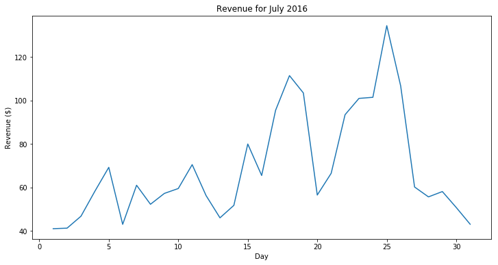
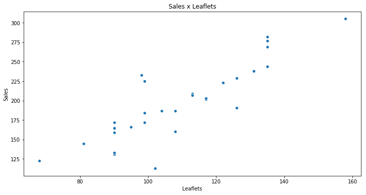
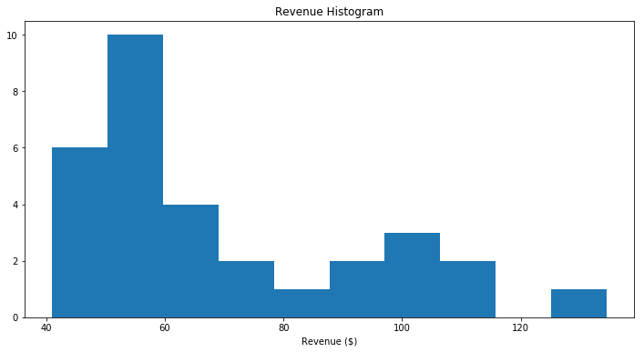
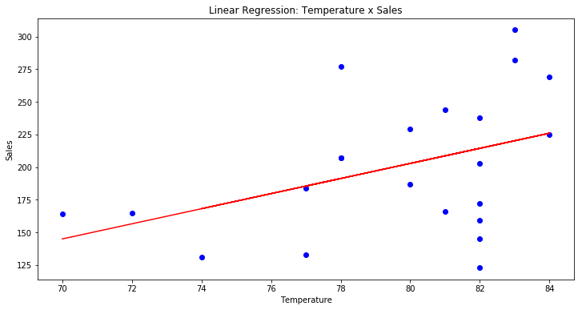
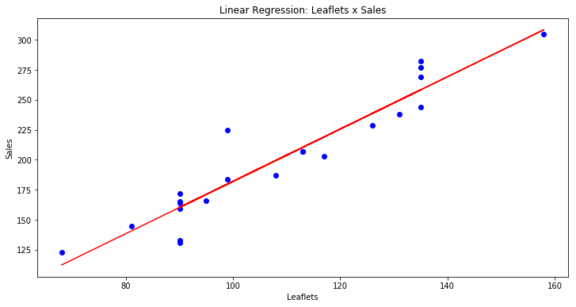
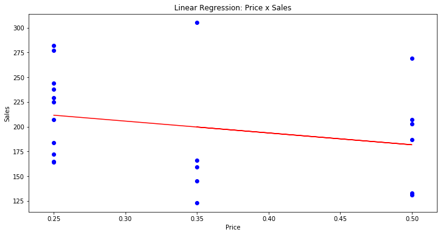

# Introdução a Python & Machine Learning

Este trabalho é da matéria __Programando IA com Python__ do curso __MBA em Artificial Intelligence & Machine Learning__ da FIAP.
Ao trabalhar com o dataset *lemonadade.csv*, visa a familiarização com esses principais conceitos:

* Numpy;
* Pandas;
* Análise Exploratória de dados;
* Regressão linear.

Para concluir a tarefa, os seguintes itens foram respondidos:

1) Leia o arquivo lemonades.csv usando pandas;  
2) retorne as informações sobre as colunas e as principais estatísticas sobre o dataset;  
3) Realize a limpeza do dataset:  

- verifique se existe valores nulos  
- remova duplicatas  
- trate os elementos faltantes (interpolação e media);  

4) Adicione uma coluna chamada "Sales" que contém o total de vendas de limão e laranja;  
5) Adicione uma coluna chamada "Revenue" que calcula o lucro (venda*preço);  
6) Retorne o lucro total;  
7) escreva uma função que receba dois parâmetros, dataset e temp(int). Se temp for 1, ele retorna a máxima temperatura observada no conjunto de dados; se 0, retorna a média do período observado; se -1, retorna a temperatura mínima  
8) escreva uma função que receba dois parametros (dataset, localização) e retorne o dataset com o preço do limão e laranja ajustados em 15% se a localização for 'Park' ou ajustados em 10% se a localização for 'Beach';  
9) escreva uma função que receba o dataset como parâmetro e retorne o dataset com uma coluna a mais que mostre o rank de temperatura. O dataset retornado precisa estar ordenado de acordo com rank;  
10) Imprima um gráfico de linha que retorne o lucro ao longo do tempo
11) crie um scatter-plot leaflets x sales. Existe alguma correlação entre os dados?
12) crie um histograma que mostre o lucro (revenue) com 10 bins
13) crie um gráfico de linha que compute o lucro por tipo de fruta ao longo do tempo.
14) usando regressão linear, prediga vendas a partir de:

- temperature
- leafltes
- price
- retorne o gráfico com a reta ajustada aos dados para cada variável

15) Usando regressão linear, prediga vendas a partir das três variáveis juntas;
16) Usando a Regressão Linear implementada em sala como modelo, generalize o algoritmo para que ele possa ser usado para regressão multivariada;
17) Aplique o algoritmo implementado no conjunto de dados consumo cerveja usando as mesmas features para treinamento. Compare os resultados que você obteve com os resultados obtidos através da Scikit Learning.


```python
import matplotlib.pyplot as plt
import numpy as np
from pandas import Series, DataFrame
import pandas as pd
import seaborn as sns
```


```python
df = pd.read_csv("Lemonade2016.csv")
```


```python
df.head()
```


<div>
<style scoped>
    .dataframe tbody tr th:only-of-type {
        vertical-align: middle;
    }

    .dataframe tbody tr th {
        vertical-align: top;
    }

    .dataframe thead th {
        text-align: right;
    }
</style>
<table border="1" class="dataframe">
  <thead>
    <tr style="text-align: right;">
      <th></th>
      <th>Date</th>
      <th>Location</th>
      <th>Lemon</th>
      <th>Orange</th>
      <th>Temperature</th>
      <th>Leaflets</th>
      <th>Price</th>
    </tr>
  </thead>
  <tbody>
    <tr>
      <th>0</th>
      <td>7/1/2016</td>
      <td>Park</td>
      <td>97</td>
      <td>67</td>
      <td>70</td>
      <td>90.0</td>
      <td>0.25</td>
    </tr>
    <tr>
      <th>1</th>
      <td>7/2/2016</td>
      <td>Park</td>
      <td>98</td>
      <td>67</td>
      <td>72</td>
      <td>90.0</td>
      <td>0.25</td>
    </tr>
    <tr>
      <th>2</th>
      <td>7/3/2016</td>
      <td>Park</td>
      <td>110</td>
      <td>77</td>
      <td>71</td>
      <td>104.0</td>
      <td>0.25</td>
    </tr>
    <tr>
      <th>3</th>
      <td>7/4/2016</td>
      <td>Beach</td>
      <td>134</td>
      <td>99</td>
      <td>76</td>
      <td>98.0</td>
      <td>0.25</td>
    </tr>
    <tr>
      <th>4</th>
      <td>7/5/2016</td>
      <td>Beach</td>
      <td>159</td>
      <td>118</td>
      <td>78</td>
      <td>135.0</td>
      <td>0.25</td>
    </tr>
  </tbody>
</table>
</div>


```python
df.info()
```

    <class 'pandas.core.frame.DataFrame'>
    RangeIndex: 32 entries, 0 to 31
    Data columns (total 7 columns):
    Date           31 non-null object
    Location       32 non-null object
    Lemon          32 non-null int64
    Orange         32 non-null int64
    Temperature    32 non-null int64
    Leaflets       31 non-null float64
    Price          32 non-null float64
    dtypes: float64(2), int64(3), object(2)
    memory usage: 1.8+ KB
    


```python
df.describe()
```


<div>
<style scoped>
    .dataframe tbody tr th:only-of-type {
        vertical-align: middle;
    }

    .dataframe tbody tr th {
        vertical-align: top;
    }

    .dataframe thead th {
        text-align: right;
    }
</style>
<table border="1" class="dataframe">
  <thead>
    <tr style="text-align: right;">
      <th></th>
      <th>Lemon</th>
      <th>Orange</th>
      <th>Temperature</th>
      <th>Leaflets</th>
      <th>Price</th>
    </tr>
  </thead>
  <tbody>
    <tr>
      <th>count</th>
      <td>32.000000</td>
      <td>32.000000</td>
      <td>32.000000</td>
      <td>31.000000</td>
      <td>32.000000</td>
    </tr>
    <tr>
      <th>mean</th>
      <td>116.156250</td>
      <td>80.000000</td>
      <td>78.968750</td>
      <td>108.548387</td>
      <td>0.354687</td>
    </tr>
    <tr>
      <th>std</th>
      <td>25.823357</td>
      <td>21.863211</td>
      <td>4.067847</td>
      <td>20.117718</td>
      <td>0.113137</td>
    </tr>
    <tr>
      <th>min</th>
      <td>71.000000</td>
      <td>42.000000</td>
      <td>70.000000</td>
      <td>68.000000</td>
      <td>0.250000</td>
    </tr>
    <tr>
      <th>25%</th>
      <td>98.000000</td>
      <td>66.750000</td>
      <td>77.000000</td>
      <td>90.000000</td>
      <td>0.250000</td>
    </tr>
    <tr>
      <th>50%</th>
      <td>113.500000</td>
      <td>76.500000</td>
      <td>80.500000</td>
      <td>108.000000</td>
      <td>0.350000</td>
    </tr>
    <tr>
      <th>75%</th>
      <td>131.750000</td>
      <td>95.000000</td>
      <td>82.000000</td>
      <td>124.000000</td>
      <td>0.500000</td>
    </tr>
    <tr>
      <th>max</th>
      <td>176.000000</td>
      <td>129.000000</td>
      <td>84.000000</td>
      <td>158.000000</td>
      <td>0.500000</td>
    </tr>
  </tbody>
</table>
</div>


```python
df.isnull().any()
```


    Date            True
    Location       False
    Lemon          False
    Orange         False
    Temperature    False
    Leaflets        True
    Price          False
    dtype: bool


```python
df.isnull().sum()
```


    Date           1
    Location       0
    Lemon          0
    Orange         0
    Temperature    0
    Leaflets       1
    Price          0
    dtype: int64


```python
df[df['Date'].isnull()]
```


<div>
<style scoped>
    .dataframe tbody tr th:only-of-type {
        vertical-align: middle;
    }

    .dataframe tbody tr th {
        vertical-align: top;
    }

    .dataframe thead th {
        text-align: right;
    }
</style>
<table border="1" class="dataframe">
  <thead>
    <tr style="text-align: right;">
      <th></th>
      <th>Date</th>
      <th>Location</th>
      <th>Lemon</th>
      <th>Orange</th>
      <th>Temperature</th>
      <th>Leaflets</th>
      <th>Price</th>
    </tr>
  </thead>
  <tbody>
    <tr>
      <th>8</th>
      <td>NaN</td>
      <td>Beach</td>
      <td>123</td>
      <td>86</td>
      <td>82</td>
      <td>113.0</td>
      <td>0.25</td>
    </tr>
  </tbody>
</table>
</div>


```python
df[6:11]
```


<div>
<style scoped>
    .dataframe tbody tr th:only-of-type {
        vertical-align: middle;
    }

    .dataframe tbody tr th {
        vertical-align: top;
    }

    .dataframe thead th {
        text-align: right;
    }
</style>
<table border="1" class="dataframe">
  <thead>
    <tr style="text-align: right;">
      <th></th>
      <th>Date</th>
      <th>Location</th>
      <th>Lemon</th>
      <th>Orange</th>
      <th>Temperature</th>
      <th>Leaflets</th>
      <th>Price</th>
    </tr>
  </thead>
  <tbody>
    <tr>
      <th>6</th>
      <td>7/6/2016</td>
      <td>Beach</td>
      <td>103</td>
      <td>69</td>
      <td>82</td>
      <td>90.0</td>
      <td>0.25</td>
    </tr>
    <tr>
      <th>7</th>
      <td>7/7/2016</td>
      <td>Beach</td>
      <td>143</td>
      <td>101</td>
      <td>81</td>
      <td>135.0</td>
      <td>0.25</td>
    </tr>
    <tr>
      <th>8</th>
      <td>NaN</td>
      <td>Beach</td>
      <td>123</td>
      <td>86</td>
      <td>82</td>
      <td>113.0</td>
      <td>0.25</td>
    </tr>
    <tr>
      <th>9</th>
      <td>7/9/2016</td>
      <td>Beach</td>
      <td>134</td>
      <td>95</td>
      <td>80</td>
      <td>126.0</td>
      <td>0.25</td>
    </tr>
    <tr>
      <th>10</th>
      <td>7/10/2016</td>
      <td>Beach</td>
      <td>140</td>
      <td>98</td>
      <td>82</td>
      <td>131.0</td>
      <td>0.25</td>
    </tr>
  </tbody>
</table>
</div>


```python
df['Date'].fillna('7/8/2016', inplace = True)
```


```python
df['Date'][8]
```


    '7/8/2016'


```python
df[df['Leaflets'].isnull()]
```


<div>
<style scoped>
    .dataframe tbody tr th:only-of-type {
        vertical-align: middle;
    }

    .dataframe tbody tr th {
        vertical-align: top;
    }

    .dataframe thead th {
        text-align: right;
    }
</style>
<table border="1" class="dataframe">
  <thead>
    <tr style="text-align: right;">
      <th></th>
      <th>Date</th>
      <th>Location</th>
      <th>Lemon</th>
      <th>Orange</th>
      <th>Temperature</th>
      <th>Leaflets</th>
      <th>Price</th>
    </tr>
  </thead>
  <tbody>
    <tr>
      <th>20</th>
      <td>7/20/2016</td>
      <td>Park</td>
      <td>71</td>
      <td>42</td>
      <td>70</td>
      <td>NaN</td>
      <td>0.5</td>
    </tr>
  </tbody>
</table>
</div>


```python
df[18:23]
```


<div>
<style scoped>
    .dataframe tbody tr th:only-of-type {
        vertical-align: middle;
    }

    .dataframe tbody tr th {
        vertical-align: top;
    }

    .dataframe thead th {
        text-align: right;
    }
</style>
<table border="1" class="dataframe">
  <thead>
    <tr style="text-align: right;">
      <th></th>
      <th>Date</th>
      <th>Location</th>
      <th>Lemon</th>
      <th>Orange</th>
      <th>Temperature</th>
      <th>Leaflets</th>
      <th>Price</th>
    </tr>
  </thead>
  <tbody>
    <tr>
      <th>18</th>
      <td>7/18/2016</td>
      <td>Park</td>
      <td>131</td>
      <td>92</td>
      <td>81</td>
      <td>122.0</td>
      <td>0.5</td>
    </tr>
    <tr>
      <th>19</th>
      <td>7/19/2016</td>
      <td>Park</td>
      <td>122</td>
      <td>85</td>
      <td>78</td>
      <td>113.0</td>
      <td>0.5</td>
    </tr>
    <tr>
      <th>20</th>
      <td>7/20/2016</td>
      <td>Park</td>
      <td>71</td>
      <td>42</td>
      <td>70</td>
      <td>NaN</td>
      <td>0.5</td>
    </tr>
    <tr>
      <th>21</th>
      <td>7/21/2016</td>
      <td>Park</td>
      <td>83</td>
      <td>50</td>
      <td>77</td>
      <td>90.0</td>
      <td>0.5</td>
    </tr>
    <tr>
      <th>22</th>
      <td>7/22/2016</td>
      <td>Park</td>
      <td>112</td>
      <td>75</td>
      <td>80</td>
      <td>108.0</td>
      <td>0.5</td>
    </tr>
  </tbody>
</table>
</div>


```python
print("Média de folhetos para o Parque: %d" % df[df['Location'] == 'Park'].mean()['Leaflets'].round(decimals = 0))
```

    Média de folhetos para o Parque: 109
    


```python
df['Leaflets'].interpolate(inplace = True)
```


```python
df['Leaflets'] = df['Leaflets'].round(decimals = 0)
```


```python
df['Leaflets'][20]
```


    102.0


```python
df[df.duplicated()]
```


<div>
<style scoped>
    .dataframe tbody tr th:only-of-type {
        vertical-align: middle;
    }

    .dataframe tbody tr th {
        vertical-align: top;
    }

    .dataframe thead th {
        text-align: right;
    }
</style>
<table border="1" class="dataframe">
  <thead>
    <tr style="text-align: right;">
      <th></th>
      <th>Date</th>
      <th>Location</th>
      <th>Lemon</th>
      <th>Orange</th>
      <th>Temperature</th>
      <th>Leaflets</th>
      <th>Price</th>
    </tr>
  </thead>
  <tbody>
    <tr>
      <th>6</th>
      <td>7/6/2016</td>
      <td>Beach</td>
      <td>103</td>
      <td>69</td>
      <td>82</td>
      <td>90.0</td>
      <td>0.25</td>
    </tr>
  </tbody>
</table>
</div>


```python
df.drop_duplicates(inplace = True)
```


```python
df.info()
```

    <class 'pandas.core.frame.DataFrame'>
    Int64Index: 31 entries, 0 to 31
    Data columns (total 7 columns):
    Date           31 non-null object
    Location       31 non-null object
    Lemon          31 non-null int64
    Orange         31 non-null int64
    Temperature    31 non-null int64
    Leaflets       31 non-null float64
    Price          31 non-null float64
    dtypes: float64(2), int64(3), object(2)
    memory usage: 1.9+ KB
    


```python
df['Sales'] = df['Lemon'] + df['Orange']
```


```python
df['Revenue'] = df['Sales'] * df['Price']
```


```python
print("Lucro total = $%.2f" % df['Revenue'].sum())
```

    Lucro total = $2138.00
    


```python
def temp_analise(dataset,temp):
    '''
    Retorna o valor da temperatura (min/media/max) para o dataset de entrada
    Input:
        dataset = conjunto de dados
        temp    =  1 para temperatura máxima
                =  0 para temperatura média
                = -1 para temperatura mínima
    Output: temperatura em Fahrenheit
    '''    
    if temp == 1:
        return dataset['Temperature'].max()
    if temp == 0:
        return dataset['Temperature'].mean()
    if temp == -1:
        return dataset['Temperature'].min()
    
```


```python
print('Temperatura máxima: %.1f' % temp_analise(df,1))
print('Temperatura média: %.1f' % temp_analise(df,0))
print('Temperatura mínima: %.1f' % temp_analise(df,-1))
```

    Temperatura máxima: 84.0
    Temperatura média: 78.9
    Temperatura mínima: 70.0
    


```python
def loc_reajpreco(dataset,localizacao):
    '''
    Reajusta o preço de acordo com a localidade
    Input:
        dataset        = conjunto de dados
        localizacao    =  'Park' ou 'Beach'
    Output: dataset com o preço reajustado
    '''
    new_dataset = DataFrame.copy(dataset)
    if localizacao == 'Park':
        new_dataset.loc[new_dataset['Location'] == 'Park', 'Price'] = (new_dataset['Price']* 1.15).round(decimals = 2)
        return new_dataset
    if localizacao == 'Beach':
        new_dataset.loc[new_dataset['Location'] == 'Beach', 'Price'] = (new_dataset['Price']* 1.10).round(decimals = 2)
        return new_dataset
```


```python
DataFrame.head(loc_reajpreco(df, 'Park'))
```


<div>
<style scoped>
    .dataframe tbody tr th:only-of-type {
        vertical-align: middle;
    }

    .dataframe tbody tr th {
        vertical-align: top;
    }

    .dataframe thead th {
        text-align: right;
    }
</style>
<table border="1" class="dataframe">
  <thead>
    <tr style="text-align: right;">
      <th></th>
      <th>Date</th>
      <th>Location</th>
      <th>Lemon</th>
      <th>Orange</th>
      <th>Temperature</th>
      <th>Leaflets</th>
      <th>Price</th>
      <th>Sales</th>
      <th>Revenue</th>
    </tr>
  </thead>
  <tbody>
    <tr>
      <th>0</th>
      <td>7/1/2016</td>
      <td>Park</td>
      <td>97</td>
      <td>67</td>
      <td>70</td>
      <td>90.0</td>
      <td>0.29</td>
      <td>164</td>
      <td>41.00</td>
    </tr>
    <tr>
      <th>1</th>
      <td>7/2/2016</td>
      <td>Park</td>
      <td>98</td>
      <td>67</td>
      <td>72</td>
      <td>90.0</td>
      <td>0.29</td>
      <td>165</td>
      <td>41.25</td>
    </tr>
    <tr>
      <th>2</th>
      <td>7/3/2016</td>
      <td>Park</td>
      <td>110</td>
      <td>77</td>
      <td>71</td>
      <td>104.0</td>
      <td>0.29</td>
      <td>187</td>
      <td>46.75</td>
    </tr>
    <tr>
      <th>3</th>
      <td>7/4/2016</td>
      <td>Beach</td>
      <td>134</td>
      <td>99</td>
      <td>76</td>
      <td>98.0</td>
      <td>0.25</td>
      <td>233</td>
      <td>58.25</td>
    </tr>
    <tr>
      <th>4</th>
      <td>7/5/2016</td>
      <td>Beach</td>
      <td>159</td>
      <td>118</td>
      <td>78</td>
      <td>135.0</td>
      <td>0.25</td>
      <td>277</td>
      <td>69.25</td>
    </tr>
  </tbody>
</table>
</div>


```python
DataFrame.head(loc_reajpreco(df, 'Beach'))
```


<div>
<style scoped>
    .dataframe tbody tr th:only-of-type {
        vertical-align: middle;
    }

    .dataframe tbody tr th {
        vertical-align: top;
    }

    .dataframe thead th {
        text-align: right;
    }
</style>
<table border="1" class="dataframe">
  <thead>
    <tr style="text-align: right;">
      <th></th>
      <th>Date</th>
      <th>Location</th>
      <th>Lemon</th>
      <th>Orange</th>
      <th>Temperature</th>
      <th>Leaflets</th>
      <th>Price</th>
      <th>Sales</th>
      <th>Revenue</th>
    </tr>
  </thead>
  <tbody>
    <tr>
      <th>0</th>
      <td>7/1/2016</td>
      <td>Park</td>
      <td>97</td>
      <td>67</td>
      <td>70</td>
      <td>90.0</td>
      <td>0.25</td>
      <td>164</td>
      <td>41.00</td>
    </tr>
    <tr>
      <th>1</th>
      <td>7/2/2016</td>
      <td>Park</td>
      <td>98</td>
      <td>67</td>
      <td>72</td>
      <td>90.0</td>
      <td>0.25</td>
      <td>165</td>
      <td>41.25</td>
    </tr>
    <tr>
      <th>2</th>
      <td>7/3/2016</td>
      <td>Park</td>
      <td>110</td>
      <td>77</td>
      <td>71</td>
      <td>104.0</td>
      <td>0.25</td>
      <td>187</td>
      <td>46.75</td>
    </tr>
    <tr>
      <th>3</th>
      <td>7/4/2016</td>
      <td>Beach</td>
      <td>134</td>
      <td>99</td>
      <td>76</td>
      <td>98.0</td>
      <td>0.28</td>
      <td>233</td>
      <td>58.25</td>
    </tr>
    <tr>
      <th>4</th>
      <td>7/5/2016</td>
      <td>Beach</td>
      <td>159</td>
      <td>118</td>
      <td>78</td>
      <td>135.0</td>
      <td>0.28</td>
      <td>277</td>
      <td>69.25</td>
    </tr>
  </tbody>
</table>
</div>


```python
def temp_rank(dataset):
    '''
    Ordena o dataset por ordem descrecente da temperatura e cria o rank TempRank
    Input:
        dataset = conjunto de dados
    Output: dataset ordenado com a nova coluna TempRank
    '''
    dataset_temp = DataFrame.copy(dataset.sort_values('Temperature', ascending=False))
    dataset_temp['TempRank'] = range(1,len(dataset_temp)+1)
    return dataset_temp
```


```python
DataFrame.head(temp_rank(df))
```


<div>
<style scoped>
    .dataframe tbody tr th:only-of-type {
        vertical-align: middle;
    }

    .dataframe tbody tr th {
        vertical-align: top;
    }

    .dataframe thead th {
        text-align: right;
    }
</style>
<table border="1" class="dataframe">
  <thead>
    <tr style="text-align: right;">
      <th></th>
      <th>Date</th>
      <th>Location</th>
      <th>Lemon</th>
      <th>Orange</th>
      <th>Temperature</th>
      <th>Leaflets</th>
      <th>Price</th>
      <th>Sales</th>
      <th>Revenue</th>
      <th>TempRank</th>
    </tr>
  </thead>
  <tbody>
    <tr>
      <th>25</th>
      <td>7/25/2016</td>
      <td>Park</td>
      <td>156</td>
      <td>113</td>
      <td>84</td>
      <td>135.0</td>
      <td>0.50</td>
      <td>269</td>
      <td>134.50</td>
      <td>1</td>
    </tr>
    <tr>
      <th>12</th>
      <td>7/12/2016</td>
      <td>Beach</td>
      <td>130</td>
      <td>95</td>
      <td>84</td>
      <td>99.0</td>
      <td>0.25</td>
      <td>225</td>
      <td>56.25</td>
      <td>2</td>
    </tr>
    <tr>
      <th>26</th>
      <td>7/26/2016</td>
      <td>Park</td>
      <td>176</td>
      <td>129</td>
      <td>83</td>
      <td>158.0</td>
      <td>0.35</td>
      <td>305</td>
      <td>106.75</td>
      <td>3</td>
    </tr>
    <tr>
      <th>11</th>
      <td>7/11/2016</td>
      <td>Beach</td>
      <td>162</td>
      <td>120</td>
      <td>83</td>
      <td>135.0</td>
      <td>0.25</td>
      <td>282</td>
      <td>70.50</td>
      <td>4</td>
    </tr>
    <tr>
      <th>10</th>
      <td>7/10/2016</td>
      <td>Beach</td>
      <td>140</td>
      <td>98</td>
      <td>82</td>
      <td>131.0</td>
      <td>0.25</td>
      <td>238</td>
      <td>59.50</td>
      <td>5</td>
    </tr>
  </tbody>
</table>
</div>


```python
df['Date'] = pd.to_datetime(df['Date'])
```


```python
df['Day'] = df['Date'].apply(lambda x: x.day)
```


```python
DataFrame.head(df)
```


<div>
<style scoped>
    .dataframe tbody tr th:only-of-type {
        vertical-align: middle;
    }

    .dataframe tbody tr th {
        vertical-align: top;
    }

    .dataframe thead th {
        text-align: right;
    }
</style>
<table border="1" class="dataframe">
  <thead>
    <tr style="text-align: right;">
      <th></th>
      <th>Date</th>
      <th>Location</th>
      <th>Lemon</th>
      <th>Orange</th>
      <th>Temperature</th>
      <th>Leaflets</th>
      <th>Price</th>
      <th>Sales</th>
      <th>Revenue</th>
      <th>Day</th>
    </tr>
  </thead>
  <tbody>
    <tr>
      <th>0</th>
      <td>2016-07-01</td>
      <td>Park</td>
      <td>97</td>
      <td>67</td>
      <td>70</td>
      <td>90.0</td>
      <td>0.25</td>
      <td>164</td>
      <td>41.00</td>
      <td>1</td>
    </tr>
    <tr>
      <th>1</th>
      <td>2016-07-02</td>
      <td>Park</td>
      <td>98</td>
      <td>67</td>
      <td>72</td>
      <td>90.0</td>
      <td>0.25</td>
      <td>165</td>
      <td>41.25</td>
      <td>2</td>
    </tr>
    <tr>
      <th>2</th>
      <td>2016-07-03</td>
      <td>Park</td>
      <td>110</td>
      <td>77</td>
      <td>71</td>
      <td>104.0</td>
      <td>0.25</td>
      <td>187</td>
      <td>46.75</td>
      <td>3</td>
    </tr>
    <tr>
      <th>3</th>
      <td>2016-07-04</td>
      <td>Beach</td>
      <td>134</td>
      <td>99</td>
      <td>76</td>
      <td>98.0</td>
      <td>0.25</td>
      <td>233</td>
      <td>58.25</td>
      <td>4</td>
    </tr>
    <tr>
      <th>4</th>
      <td>2016-07-05</td>
      <td>Beach</td>
      <td>159</td>
      <td>118</td>
      <td>78</td>
      <td>135.0</td>
      <td>0.25</td>
      <td>277</td>
      <td>69.25</td>
      <td>5</td>
    </tr>
  </tbody>
</table>
</div>


```python
fig, axes = plt.subplots(figsize = (12,6))
renevenue_graph = sns.lineplot(x = 'Day', y = 'Revenue', data = df)
renevenue_graph.set_title('Revenue for July 2016')
renevenue_graph.set_ylabel('Revenue ($)');
```





```python
fig, axes = plt.subplots(figsize = (12,6))
salesLeaflets_graph = sns.scatterplot(x="Leaflets", y="Sales", data=df)
salesLeaflets_graph.set_title('Sales x Leaflets');
```





```python
fig, axes = plt.subplots(figsize = (12,6))
revenueHist_graph = plt.hist(df['Revenue'], bins = 10)
plt.xlabel('Revenue ($)')
plt.title('Revenue Histogram');
```





```python
# Exercicio 14
msk = np.random.rand(len(df)) < 0.7
train = df[msk]
test = df[~msk]
```


```python
from sklearn import linear_model

# Temperature
regr_temp = linear_model.LinearRegression()
train_x = np.asanyarray(train[['Temperature']])
train_y = np.asanyarray(train[['Sales']])
regr_temp.fit (train_x, train_y)
# The coefficients
print ('Coefficients: ', regr_temp.coef_)
print ('Intercept: ',regr_temp.intercept_)
```

    Coefficients:  [[5.78524295]]
    Intercept:  [-260.03389322]
    


```python
# Plot outputs
fig, axes = plt.subplots(figsize = (12,6))
lr_tempGraph = plt.scatter(train['Temperature'], train['Sales'],  color='blue')
plt.plot(train_x, regr_temp.coef_[0][0]*train_x + regr_temp.intercept_[0], '-r')
plt.xlabel("Temperature")
plt.ylabel("Sales")
plt.title('Linear Regression: Temperature x Sales');
```





```python
# Leaflets
regr_leaflets = linear_model.LinearRegression()
train_x = np.asanyarray(train[['Leaflets']])
train_y = np.asanyarray(train[['Sales']])
regr_leaflets.fit (train_x, train_y)
# The coefficients
print ('Coefficients: ', regr_leaflets.coef_)
print ('Intercept: ',regr_leaflets.intercept_)
```

    Coefficients:  [[2.17985154]]
    Intercept:  [-35.93115762]
    


```python
# Plot outputs
fig, axes = plt.subplots(figsize = (12,6))
lr_leafGraph = plt.scatter(train['Leaflets'], train['Sales'],  color='blue')
plt.plot(train_x, regr_leaflets.coef_[0][0]*train_x + regr_leaflets.intercept_[0], '-r')
plt.xlabel("Leaflets")
plt.ylabel("Sales")
plt.title('Linear Regression: Leaflets x Sales');
```





```python
# Price
regr_price = linear_model.LinearRegression()
train_x = np.asanyarray(train[['Price']])
train_y = np.asanyarray(train[['Sales']])
regr_price.fit (train_x, train_y)
# The coefficients
print ('Coefficients: ', regr_price.coef_)
print ('Intercept: ',regr_price.intercept_)
```

    Coefficients:  [[-119.51401869]]
    Intercept:  [241.42523364]
    


```python
# Plot outputs
fig, axes = plt.subplots(figsize = (12,6))
lr_priceGraph = plt.scatter(train['Price'], train['Sales'],  color='blue')
plt.plot(train_x, regr_price.coef_[0][0]*train_x + regr_price.intercept_[0], '-r')
plt.xlabel("Price")
plt.ylabel("Sales")
plt.title('Linear Regression: Price x Sales');
```





```python
# Exercicio 14
regr_mult = linear_model.LinearRegression()
train_x = np.asanyarray(train[['Temperature', 'Leaflets','Price']])
train_y = np.asanyarray(train[['Sales']])
regr_mult.fit (train_x, train_y)
# The coefficients
print ('Coefficients: ', regr_mult.coef_)
print ('Intercept: ',regr_mult.intercept_)
```

    Coefficients:  [[  1.74206476   2.04650281 -83.87733523]]
    Intercept:  [-131.59391602]
    


```python
# Predição
y_hat= regr_mult.predict(test[['Temperature','Leaflets','Price']])
x = np.asanyarray(test[['Temperature','Leaflets','Price']])
y = np.asanyarray(test[['Sales']])
print("Residual sum of squares: %.2f"
      % np.mean((y_hat - y) ** 2))

# Explained variance score: 1 is perfect prediction
print('Variance score: %.2f' % regr_mult.score(x, y))
```

    Residual sum of squares: 678.56
    Variance score: 0.42
    


```python

```
