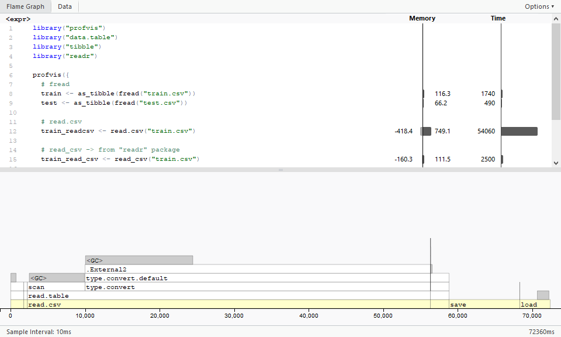
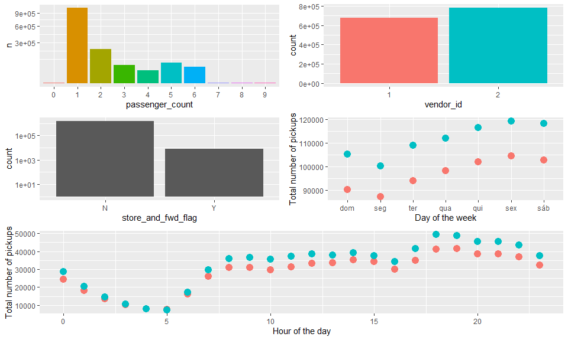

Portfolio: Learning AI with R
================
Raphael Prates
2019-11-12

  - [Kaggle’s Kernels Analysis](#kaggles-kernels-analysis)
  - [Introduction](#introduction)
  - [Reading files & Regular
    Expressions](#reading-files-regular-expressions)
      - [Library *stringr*](#library-stringr)
      - [Testing Regex Website](#testing-regex-website)
      - [Example: readlines and regex](#example-readlines-and-regex)
          - [Reading txt files](#reading-txt-files)
          - [Searching for expression](#searching-for-expression)
  - [Kernel Analysis - “NYC Taxi: Fast &
    Curious”](#kernel-analysis---nyc-taxi-fast-curious)
      - [Introduction](#introduction-1)
          - [Libraries](#libraries)
          - [Load data](#load-data)
          - [File structure and content](#file-structure-and-content)
          - [Missing values](#missing-values)
          - [Combining train and test](#combining-train-and-test)
          - [Reformating features](#reformating-features)
          - [Consistency check](#consistency-check)
      - [Individual feature
        visualizations](#individual-feature-visualizations)
          - [Trip Duration](#trip-duration)
          - [Pickup and dropoff datetime](#pickup-and-dropoff-datetime)
          - [*Passager count, vendor\_id, store\_and\_fwd\_flag, Day of
            the week and Hour of the
            Day*](#passager-count-vendor_id-store_and_fwd_flag-day-of-the-week-and-hour-of-the-day)
          - [Time series graphics](#time-series-graphics)
          - [Most common latitudes and longitudes for
            dropoff/pickup](#most-common-latitudes-and-longitudes-for-dropoffpickup)
      - [Feature relations](#feature-relations)
          - [Pickup date/time vs
            *trip\_duration*](#pickup-datetime-vs-trip_duration)
          - [Passenger count and Vendor vs
            *trip\_duration*](#passenger-count-and-vendor-vs-trip_duration)

# Kaggle’s Kernels Analysis

This project is from the [FIAP](https://www.fiap.com.br/) **MBA in
Artificial Intelligence** course.

The main purpose of this project is to learn R and Machine Learning
taking a good Kernel by reference.  
So we reproduced, compared e studied the following EDA (check the result
in the *Rmd* file):

  - **NYC Taxi EDA - Update: The fast & the curious**  
    "This is a comprehensive Exploratory Data Analysis for the [New York
    City Taxi Trip
    Duration](https://www.kaggle.com/c/nyc-taxi-trip-duration)
    competition with **tidy R** and **ggplot2**.  
    The goal of this playground challenge is to predict the duration of
    taxi rides in NYC based on features like trip coordinates or pickup
    date and time. The data comes in the shape of 1.5 million training
    observations (../input/train.csv) and 630k test observation
    (../input/test.csv). Each row contains one taxi trip.  
    In this notebook, we will first study and visualise the original
    data, engineer new features, and examine potential outliers.

# Introduction

**Intelligence definition**  
“The capacity of a system adapt itself with insufficient resources and
knowledge” - Pei Waing.

**Why R to study AI?**  
“R is one of the major languages for data science. It provides excellent
visualisation features, which is essential to explore the data before
submitting it to any automated learning, as well as assessing the
results of the learning algorithm. Many R package for machine learning
are available of the shelf and many modern methods in statistical
learning are implemented in R as part of their development.”  
From:
<https://lgatto.github.io/IntroMachineLearningWithR/an-introduction-to-machine-learning-with-r.html#why-r>

# Reading files & Regular Expressions

Regular expressions (regex) is a powerful ally when we’d like to
clean/search for informations. So let’s take a breef overview in this
subject because everyone will use it some time:

## Library *stringr*

``` r
library('stringr') # string manipulation
```

From
<https://cran.r-project.org/web/packages/stringr/vignettes/stringr.html>:

There are four main families of functions in stringr:

  - Character manipulation: these functions allow you to manipulate
    individual characters within the strings in character vectors;
  - Whitespace tools to add, remove and manipulate whitespace;
  - Locale sensitive operations whose operations will vary from locale
    to locale;
  - Pattern matching functions. These recognise four engines of pattern
    description. The most common is regular expressions, but there are
    others tools.

## Testing Regex Website

I’d like to recommend these two websites to construct and test the
regex:

Regex info: <https://docs.python.org/3/library/re.html>  
Test Online Regex: <https://regex101.com/>

For R, you can choose Flavor= Python (python and R regex are very
similar because both regex structure come from pearl).

## Example: readlines and regex

### Reading txt files

Here we are going to read a txt file and then extract some informations
about from the document:

``` r
file <- readLines("Ficha_Aluno.txt")

# Printing the file line by line
file
```

    ## [1] "Documento - Exemplo"    ""                       ""                      
    ## [4] "Turma: FIAP-04IA"       "Nome: Raphael Prates"   "Trabalho Entregue: Sim"

### Searching for expression

Here we are looking for two informations class name (Turma) and
student’s name (Nome):

``` r
file <- readLines("Ficha_Aluno.txt")

# Finding the line that cointains Turma:
line_turma <- grep("Turma", file, value = TRUE)

# Extracting only the value
class <- str_extract(line_turma,'FIAP-[0]*[0-9][iI][aA]')

# Finding the line that cointains Nome:
line_nome <- grep("Nome", file, value = TRUE)

# Extracting only the value
name <- unlist(str_split(line_nome,pattern = ': '))[2]

# Printing the results

paste("I am", name,"from", class,". I'm studying Machine Learning in a MBA Course and I hope that you enjoy this portfolio!")
```

    ## [1] "I am Raphael Prates from FIAP-04IA . I'm studying Machine Learning in a MBA Course and I hope that you enjoy this portfolio!"

# Kernel Analysis - “NYC Taxi: Fast & Curious”


**Kernel name:** “NYC Taxi EDA - Update: The fast & the curious”  
**Link:**
<https://www.kaggle.com/headsortails/nyc-taxi-eda-update-the-fast-the-curious>

## Introduction

Most of this work is a raw reproduction of the original one. The purpose
of this reproduction is to test and learn the commands/steps used by the
author to construct a good **Exploratory Data Analysis**. In the end, a
topic about Kmeans was added complementing the original work.  
When its possible we explored the reasons why the author choose the
functions used and compared to others alternatives.

### Libraries

``` r
library('ggplot2') # visualisation
library('scales') # visualisation
library('grid') # visualisation
library('RColorBrewer') # visualisation
library('corrplot') # visualisation
library('alluvial') # visualisation
library('dplyr') # data manipulation
library('readr') # input/output
library('data.table') # data manipulation
library('tibble') # data wrangling
library('tidyr') # data wrangling
library('stringr') # string manipulation
library('forcats') # factor manipulation
library('lubridate') # date and time
library('geosphere') # geospatial locations
library('leaflet') # maps
library('leaflet.extras') # maps
library('maps') # maps
library('xgboost') # modelling
library('caret') # modelling
library('profvis') # code execution time anaylsis
library('webshot')
```

### Load data

#### Original code

``` r
library("data.table")
library("tibble")

train <- as_tibble(fread('train.csv'))
```

#### **Comparison with others alternatives**

In R, **read.csv** is part of the regular functions and is used for load
data.frame from a *csv* file. But when we’re dealing with a huge
data.frame this function can take a long time to run.

``` r
print(paste("In this case the dataset is quite huge:",dim(train)[1], "rows and",
            dim(train)[2], "columns."))
```

    ## [1] "In this case the dataset is quite huge: 1458644 rows and 11 columns."

So in this part the author used a function called **fread** that
performs much faster than *read.csv* (check the time of each function
using profvis\!\!).  
After that other function should be compared: **load**. This function is
used to load variables that have been stored in a *.RData* file and runs
very fast comparing with *read.csv* and *fread*.  
When is a good ideia to use *load*? When it’s possible to use a
background process to update the data.frame and save it in *.RData*
file.  
Let’s take a look at the three possibilities:

``` r
library("profvis")
library("data.table")
library("tibble")
library("readr")

profvis({
  # fread
  train <- as_tibble(fread("train.csv"))
  test <- as_tibble(fread("test.csv"))
  
  # read.csv
  train_readcsv <- read.csv("train.csv")
  
  # read_csv -> from "readr" package
  train_read_csv <- read_csv("train.csv")
  
  # loading RData
  save(train_readcsv, file = "train_data.RData")
  rm(train_readcsv)
  load(file = "train_data.RData")
})
```

<!-- -->

#### **Tibbles vs data frames**

All the information bellow was “greped” from
<https://cran.r-project.org/web/packages/tibble/vignettes/tibble.html>  
**Tibbles**  
“Tibbles are a modern take on data frames. They keep the features that
have stood the test of time, and drop the features that used to be
convenient but are now frustrating (i.e. converting character vectors to
factors).”

Major points:

  - It never changes an input’s type (i.e., no more stringsAsFactors =
    FALSE\!);
  - It never adjusts the names of variables (i.e names with spaces will
    keep the whitespace. Data.frame replaces whitespace for ‘.’);
  - When you print a tibble, it only shows the first ten rows and all
    the columns that fit on one screen;
  - Tibbles are quite strict about subsetting. **\[ \]** always returns
    another tibble. Contrast this with a data frame: sometimes **\[ \]**
    returns a data frame and sometimes it just returns a vector.

### File structure and content


A brief overview of our data can summaries the descriptive statistics
values of the dataset and detect abnormal items or outliers.

**For the summaries**

``` r
summary(train)
```

    ##       id              vendor_id     pickup_datetime    dropoff_datetime  
    ##  Length:1458644     Min.   :1.000   Length:1458644     Length:1458644    
    ##  Class :character   1st Qu.:1.000   Class :character   Class :character  
    ##  Mode  :character   Median :2.000   Mode  :character   Mode  :character  
    ##                     Mean   :1.535                                        
    ##                     3rd Qu.:2.000                                        
    ##                     Max.   :2.000                                        
    ##  passenger_count pickup_longitude  pickup_latitude dropoff_longitude
    ##  Min.   :0.000   Min.   :-121.93   Min.   :34.36   Min.   :-121.93  
    ##  1st Qu.:1.000   1st Qu.: -73.99   1st Qu.:40.74   1st Qu.: -73.99  
    ##  Median :1.000   Median : -73.98   Median :40.75   Median : -73.98  
    ##  Mean   :1.665   Mean   : -73.97   Mean   :40.75   Mean   : -73.97  
    ##  3rd Qu.:2.000   3rd Qu.: -73.97   3rd Qu.:40.77   3rd Qu.: -73.96  
    ##  Max.   :9.000   Max.   : -61.34   Max.   :51.88   Max.   : -61.34  
    ##  dropoff_latitude store_and_fwd_flag trip_duration    
    ##  Min.   :32.18    Length:1458644     Min.   :      1  
    ##  1st Qu.:40.74    Class :character   1st Qu.:    397  
    ##  Median :40.75    Mode  :character   Median :    662  
    ##  Mean   :40.75                       Mean   :    959  
    ##  3rd Qu.:40.77                       3rd Qu.:   1075  
    ##  Max.   :43.92                       Max.   :3526282

``` r
summary(test)
```

    ##       id              vendor_id     pickup_datetime    passenger_count
    ##  Length:625134      Min.   :1.000   Length:625134      Min.   :0.000  
    ##  Class :character   1st Qu.:1.000   Class :character   1st Qu.:1.000  
    ##  Mode  :character   Median :2.000   Mode  :character   Median :1.000  
    ##                     Mean   :1.535                      Mean   :1.662  
    ##                     3rd Qu.:2.000                      3rd Qu.:2.000  
    ##                     Max.   :2.000                      Max.   :9.000  
    ##  pickup_longitude  pickup_latitude dropoff_longitude dropoff_latitude
    ##  Min.   :-121.93   Min.   :37.39   Min.   :-121.93   Min.   :36.60   
    ##  1st Qu.: -73.99   1st Qu.:40.74   1st Qu.: -73.99   1st Qu.:40.74   
    ##  Median : -73.98   Median :40.75   Median : -73.98   Median :40.75   
    ##  Mean   : -73.97   Mean   :40.75   Mean   : -73.97   Mean   :40.75   
    ##  3rd Qu.: -73.97   3rd Qu.:40.77   3rd Qu.: -73.96   3rd Qu.:40.77   
    ##  Max.   : -69.25   Max.   :42.81   Max.   : -67.50   Max.   :48.86   
    ##  store_and_fwd_flag
    ##  Length:625134     
    ##  Class :character  
    ##  Mode  :character  
    ##                    
    ##                    
    ## 

**Data overview**

``` r
library("dplyr")
glimpse(train)
```

    ## Observations: 1,458,644
    ## Variables: 11
    ## $ id                 <chr> "id2875421", "id2377394", "id3858529", "id350467...
    ## $ vendor_id          <int> 2, 1, 2, 2, 2, 2, 1, 2, 1, 2, 2, 2, 2, 2, 2, 1, ...
    ## $ pickup_datetime    <chr> "2016-03-14 17:24:55", "2016-06-12 00:43:35", "2...
    ## $ dropoff_datetime   <chr> "2016-03-14 17:32:30", "2016-06-12 00:54:38", "2...
    ## $ passenger_count    <int> 1, 1, 1, 1, 1, 6, 4, 1, 1, 1, 1, 4, 2, 1, 1, 1, ...
    ## $ pickup_longitude   <dbl> -73.98215, -73.98042, -73.97903, -74.01004, -73....
    ## $ pickup_latitude    <dbl> 40.76794, 40.73856, 40.76394, 40.71997, 40.79321...
    ## $ dropoff_longitude  <dbl> -73.96463, -73.99948, -74.00533, -74.01227, -73....
    ## $ dropoff_latitude   <dbl> 40.76560, 40.73115, 40.71009, 40.70672, 40.78252...
    ## $ store_and_fwd_flag <chr> "N", "N", "N", "N", "N", "N", "N", "N", "N", "N"...
    ## $ trip_duration      <int> 455, 663, 2124, 429, 435, 443, 341, 1551, 255, 1...

``` r
glimpse(test)
```

    ## Observations: 625,134
    ## Variables: 9
    ## $ id                 <chr> "id3004672", "id3505355", "id1217141", "id215012...
    ## $ vendor_id          <int> 1, 1, 1, 2, 1, 1, 1, 1, 2, 2, 1, 2, 1, 2, 1, 1, ...
    ## $ pickup_datetime    <chr> "2016-06-30 23:59:58", "2016-06-30 23:59:53", "2...
    ## $ passenger_count    <int> 1, 1, 1, 1, 1, 1, 1, 2, 2, 1, 4, 1, 1, 1, 1, 1, ...
    ## $ pickup_longitude   <dbl> -73.98813, -73.96420, -73.99744, -73.95607, -73....
    ## $ pickup_latitude    <dbl> 40.73203, 40.67999, 40.73758, 40.77190, 40.76147...
    ## $ dropoff_longitude  <dbl> -73.99017, -73.95981, -73.98616, -73.98643, -73....
    ## $ dropoff_latitude   <dbl> 40.75668, 40.65540, 40.72952, 40.73047, 40.75589...
    ## $ store_and_fwd_flag <chr> "N", "N", "N", "N", "N", "N", "N", "N", "N", "N"...

#### Comparison with others alternatives

Another popular way to make a data overview is using *str*. It is very
similar to *glimpse* but *str* shows less data.

``` r
str(train)
```

    ## Classes 'tbl_df', 'tbl' and 'data.frame':    1458644 obs. of  11 variables:
    ##  $ id                : chr  "id2875421" "id2377394" "id3858529" "id3504673" ...
    ##  $ vendor_id         : int  2 1 2 2 2 2 1 2 1 2 ...
    ##  $ pickup_datetime   : chr  "2016-03-14 17:24:55" "2016-06-12 00:43:35" "2016-01-19 11:35:24" "2016-04-06 19:32:31" ...
    ##  $ dropoff_datetime  : chr  "2016-03-14 17:32:30" "2016-06-12 00:54:38" "2016-01-19 12:10:48" "2016-04-06 19:39:40" ...
    ##  $ passenger_count   : int  1 1 1 1 1 6 4 1 1 1 ...
    ##  $ pickup_longitude  : num  -74 -74 -74 -74 -74 ...
    ##  $ pickup_latitude   : num  40.8 40.7 40.8 40.7 40.8 ...
    ##  $ dropoff_longitude : num  -74 -74 -74 -74 -74 ...
    ##  $ dropoff_latitude  : num  40.8 40.7 40.7 40.7 40.8 ...
    ##  $ store_and_fwd_flag: chr  "N" "N" "N" "N" ...
    ##  $ trip_duration     : int  455 663 2124 429 435 443 341 1551 255 1225 ...
    ##  - attr(*, ".internal.selfref")=<externalptr>

#### First observations

  - vendor\_id only takes the values 1 or 2, presumably to differentiate
    two taxi companies  
    We can easily check this doing:

<!-- end list -->

``` r
levels(as.factor(train$vendor_id))
```

    ## [1] "1" "2"

  - pickup\_datetime and (in the training set) dropoff\_datetime are
    combinations of date and time that we will have to re-format into a
    more useful shape  
  - passenger\_count takes a median of 1 and a maximum of 9 in both data
    sets  
  - The pickup/dropoff\_longitute/latitute describes the geographical
    coordinates where the meter was activate/deactivated  
  - store\_and\_fwd\_flag is a flag that indicates whether the trip data
    was sent immediately to the vendor (“N”) or held in the memory of
    the taxi because there was no connection to the server (“Y”). Maybe
    there could be a correlation with certain geographical areas with
    bad reception?  
  - trip\_duration: our target feature in the training data is measured
    in seconds.

### Missing values

To avoid an inappropriate analysis of the data, the missing values
should be analysed to measure their impact in the whole dataset.  
If the number of cases is **less than 5%** of the sample, then the
researcher **can drop them.**  
For more info about this subject:
<https://www.statisticssolutions.com/missing-values-in-data/>  
Luckly there is no missing values in data (easy mode):

``` r
sum(is.na(train))
```

    ## [1] 0

``` r
sum(is.na(test))
```

    ## [1] 0

### Combining train and test

Here the author did an interesting move: he combined *train* and *test*
data sets into a single one in order to avoid a closely approach that
matches just one part of data.  
**CAUTION:** we can only combine the two data sets for a better overview
but for the creation of a machine learning model we should keep *train*
and *test* separate.

``` r
# Mutate creates dset, dropff_datetime and trip_duration columns for test dataset
# For train dataset only dset is created by mutate
# bind_rows combines the data sets into one
combine <- bind_rows(train %>% mutate(dset = "train"), 
                     test %>% mutate(dset = "test",
                                     dropoff_datetime = NA,
                                     trip_duration = NA))
combine <- combine %>% mutate(dset = factor(dset))
glimpse(combine)
```

    ## Observations: 2,083,778
    ## Variables: 12
    ## $ id                 <chr> "id2875421", "id2377394", "id3858529", "id350467...
    ## $ vendor_id          <int> 2, 1, 2, 2, 2, 2, 1, 2, 1, 2, 2, 2, 2, 2, 2, 1, ...
    ## $ pickup_datetime    <chr> "2016-03-14 17:24:55", "2016-06-12 00:43:35", "2...
    ## $ dropoff_datetime   <chr> "2016-03-14 17:32:30", "2016-06-12 00:54:38", "2...
    ## $ passenger_count    <int> 1, 1, 1, 1, 1, 6, 4, 1, 1, 1, 1, 4, 2, 1, 1, 1, ...
    ## $ pickup_longitude   <dbl> -73.98215, -73.98042, -73.97903, -74.01004, -73....
    ## $ pickup_latitude    <dbl> 40.76794, 40.73856, 40.76394, 40.71997, 40.79321...
    ## $ dropoff_longitude  <dbl> -73.96463, -73.99948, -74.00533, -74.01227, -73....
    ## $ dropoff_latitude   <dbl> 40.76560, 40.73115, 40.71009, 40.70672, 40.78252...
    ## $ store_and_fwd_flag <chr> "N", "N", "N", "N", "N", "N", "N", "N", "N", "N"...
    ## $ trip_duration      <int> 455, 663, 2124, 429, 435, 443, 341, 1551, 255, 1...
    ## $ dset               <fct> train, train, train, train, train, train, train,...

### Reformating features

For our following analysis, we will turn the data and time from
characters into date objects. We also recode vendor\_id as a factor.
This makes it easier to visualise relationships that involve these
features.

``` r
library('lubridate')
train <- train %>%
  mutate(pickup_datetime = ymd_hms(pickup_datetime),
         dropoff_datetime = ymd_hms(dropoff_datetime),
         vendor_id = factor(vendor_id),
         passenger_count = factor(passenger_count))
```

### Consistency check

**ASSUME NOTHING\!** It is worth checking whether the trip\_durations
are consistent with the intervals between the pickup\_datetime and
dropoff\_datetime. Presumably the former were directly computed from the
latter, but you never know. Below, the check variable shows “TRUE” if
the two intervals are not consistent:

``` r
train %>%
  mutate(check = abs(int_length(interval(dropoff_datetime,pickup_datetime)) + trip_duration) > 0) %>%
  select(check, pickup_datetime, dropoff_datetime, trip_duration) %>%
  group_by(check) %>%
  count()
```

    ## # A tibble: 1 x 2
    ## # Groups:   check [1]
    ##   check       n
    ##   <lgl>   <int>
    ## 1 FALSE 1458644

And we find that everything fits perfectly.

## Individual feature visualizations

“Visualizations of feature distributions and their relations are key to
understanding a data set, and they often open up new lines of inquiry. I
always recommend to examine the data from as many different perspectives
as possible to notice even subtle trends and correlations.”

### Trip Duration

``` r
library(ggplot2)

train %>%
  ggplot(aes(trip_duration)) +
  geom_histogram(fill = "red", bins = 150) +
  scale_x_log10() +
  scale_y_sqrt() +
  labs(title = "New York Taxi - EDA", x = "Trip Duration (s)", y = "Number of Events")
```

<!-- -->

We find:

  - the majority of rides follow a rather smooth distribution that looks
    almost log-normal with a peak just short of 1000 seconds, i.e. about
    17 minutes.
  - There are several suspiciously short rides with less than 10 seconds
    duration.
  - Additionally, there is a strange delta-shaped peak of trip\_duration
    just before the 1e5 seconds mark and even a few way above it:

<!-- end list -->

``` r
train %>%
  arrange(desc(trip_duration)) %>%
  select(trip_duration, pickup_datetime, dropoff_datetime, everything()) %>%
  head(10)
```

    ## # A tibble: 10 x 11
    ##    trip_duration pickup_datetime     dropoff_datetime    id    vendor_id
    ##            <int> <dttm>              <dttm>              <chr> <fct>    
    ##  1       3526282 2016-02-13 22:46:52 2016-03-25 18:18:14 id00~ 1        
    ##  2       2227612 2016-01-05 06:14:15 2016-01-31 01:01:07 id13~ 1        
    ##  3       2049578 2016-02-13 22:38:00 2016-03-08 15:57:38 id03~ 1        
    ##  4       1939736 2016-01-05 00:19:42 2016-01-27 11:08:38 id18~ 1        
    ##  5         86392 2016-02-15 23:18:06 2016-02-16 23:17:58 id19~ 2        
    ##  6         86391 2016-05-31 13:00:39 2016-06-01 13:00:30 id05~ 2        
    ##  7         86390 2016-05-06 00:00:10 2016-05-07 00:00:00 id09~ 2        
    ##  8         86387 2016-06-30 16:37:52 2016-07-01 16:37:39 id28~ 2        
    ##  9         86385 2016-06-23 16:01:45 2016-06-24 16:01:30 id13~ 2        
    ## 10         86379 2016-05-17 22:22:56 2016-05-18 22:22:35 id25~ 2        
    ## # ... with 6 more variables: passenger_count <fct>, pickup_longitude <dbl>,
    ## #   pickup_latitude <dbl>, dropoff_longitude <dbl>, dropoff_latitude <dbl>,
    ## #   store_and_fwd_flag <chr>

Those records would correspond to 24-hour trips and beyond, with a
maximum of almost 12 days. I know that rush hour can be bad, but those
values are a little unbelievable.

### Pickup and dropoff datetime

Over the year, the distributions of pickup\_datetime and
dropoff\_datetime look like this: mark and even a few way above it:

``` r
p1 <- train %>%
  ggplot(aes(pickup_datetime)) +
  geom_histogram(fill = "red", bins = 120) +
  labs(x = "Pickup dates")

p2 <- train %>%
  ggplot(aes(dropoff_datetime)) +
  geom_histogram(fill = "blue", bins = 120) +
  labs(x = "Dropoff dates")

layout <- matrix(c(1,2),2,1,byrow=FALSE)
multiplot(p1, p2, layout=layout)
```

<!-- -->

Fairly homogeneous, covering half a year between January and July 2016.
There is an interesting drop around late January early February:

``` r
train %>%
  filter(pickup_datetime > ymd("2016-01-20") & pickup_datetime < ymd("2016-02-10")) %>%
  ggplot(aes(pickup_datetime)) +
  geom_histogram(fill = "red", bins = 120)
```

<!-- -->

#### Raised questions from pickup\_datetime data visualization

**That’s winter in NYC, so maybe snow storms or other heavy weather?
Events like this should be taken into account, maybe through some handy
external data set?**

### *Passager count, vendor\_id, store\_and\_fwd\_flag, Day of the week and Hour of the Day*

In the plot above we can already see some daily and weekly modulations
in the number of trips. Let’s investigate these variations together with
the distributions of passenger\_count and vendor\_id by creating a
multi-plot panel with different components:

``` r
p1 <- train %>%
  group_by(passenger_count) %>%
  count() %>%
  ggplot(aes(passenger_count, n, fill = passenger_count)) +
  geom_col() +
  scale_y_sqrt() +
  theme(legend.position = "none")

p2 <- train %>%
  ggplot(aes(vendor_id, fill = vendor_id)) +
  geom_bar() +
  theme(legend.position = "none")

p3 <- train %>%
  ggplot(aes(store_and_fwd_flag)) +
  geom_bar() +
  theme(legend.position = "none") +
  scale_y_log10()

p4 <- train %>%
  mutate(wday = wday(pickup_datetime, label = TRUE)) %>%
  group_by(wday, vendor_id) %>%
  count() %>%
  ggplot(aes(wday, n, colour = vendor_id)) +
  geom_point(size = 4) +
  labs(x = "Day of the week", y = "Total number of pickups") +
  theme(legend.position = "none")

p5 <- train %>%
  mutate(hpick = hour(pickup_datetime)) %>%
  group_by(hpick, vendor_id) %>%
  count() %>%
  ggplot(aes(hpick, n, color = vendor_id)) +
  geom_point(size = 4) +
  labs(x = "Hour of the day", y = "Total number of pickups") +
  theme(legend.position = "none")

layout <- matrix(c(1,2,3,4,5,5),3,2,byrow=TRUE)
multiplot(p1, p2, p3, p4, p5, layout=layout)
```

<!-- -->

We find:

  - There are a few trips with zero, or seven to nine passengers but
    they are a rare exception:

<!-- end list -->

``` r
train %>%
  group_by(passenger_count) %>%
  count()
```

    ## # A tibble: 10 x 2
    ## # Groups:   passenger_count [10]
    ##    passenger_count       n
    ##    <fct>             <int>
    ##  1 0                    60
    ##  2 1               1033540
    ##  3 2                210318
    ##  4 3                 59896
    ##  5 4                 28404
    ##  6 5                 78088
    ##  7 6                 48333
    ##  8 7                     3
    ##  9 8                     1
    ## 10 9                     1

  - The vast majority of rides had only a single passenger, with two
    passengers being the (distant) second most popular option.  
  - Towards larger passenger numbers we are seeing a smooth decline
    through 3 to 4, until the larger crowds (and larger cars) give us
    another peak at 5 to 6 passengers.  
  - Vendor 2 has significantly more trips in this data set than vendor 1
    (note the logarithmic y-axis). This is true for every day of the
    week.  
  - We find an interesting pattern with Monday being the quietest day
    and Friday very busy. This is the same for the two different
    vendors, with vendor\_id == 2 showing significantly higher trip
    numbers.  
  - As one would intuitively expect, there is a strong dip during the
    early morning hours. There we also see not much difference between
    the two vendors. We find another dip around 4pm and then the numbers
    increase towards the evening.  
  - The store\_and\_fwd\_flag values, indicating whether the trip data
    was sent immediately to the vendor (“N”) or held in the memory of
    the taxi because there was no connection to the server (“Y”), show
    that there was almost no storing taking place (note again the
    logarithmic y-axis):

<!-- end list -->

``` r
train %>%
  group_by(store_and_fwd_flag) %>%
  count()
```

    ## # A tibble: 2 x 2
    ## # Groups:   store_and_fwd_flag [2]
    ##   store_and_fwd_flag       n
    ##   <chr>                <int>
    ## 1 N                  1450599
    ## 2 Y                     8045

``` r
y_count <- table(train$store_and_fwd_flag)['Y']/sum(table(train$store_and_fwd_flag))
paste0('Trip data stored in memory due to no connection represents ',round(y_count*100, digits = 2),'% of the values.')
```

    ## [1] "Trip data stored in memory due to no connection represents 0.55% of the values."

### Time series graphics

The trip volume per hour of the day depends somewhat on the month and
strongly on the day of the week:

``` r
p1 <- train %>%
  mutate(hpick = hour(pickup_datetime),
         Month = factor(month(pickup_datetime, label = TRUE))) %>%
  group_by(hpick, Month) %>%
  count() %>%
  ggplot(aes(hpick, n, color = Month)) +
  geom_line(size = 1.5) +
  labs(x = "Hour of the day", y = "count")

p2 <- train %>%
  mutate(hpick = hour(pickup_datetime),
         wday = factor(wday(pickup_datetime, label = TRUE))) %>%
  group_by(hpick, wday) %>%
  count() %>%
  ggplot(aes(hpick, n, color = wday)) +
  geom_line(size = 1.5) +
  labs(x = "Hour of the day", y = "count")

layout <- matrix(c(1,2),2,1,byrow=FALSE)
multiplot(p1, p2, layout=layout)
```

<!-- -->

We find:

  - January and June have fewer trips, whereas March and April are
    busier months. This tendency is observed for both vendor\_ids.  
  - The weekend (Sat and Sun, plus Fri to an extend) have higher trip
    numbers during the early morning ours but lower ones in the morning
    between 5 and 10, which can most likely be attributed to the
    contrast between NYC business days and weekend night life. In
    addition, trip numbers drop on a Sunday evening/night.  
    Finally, we will look at a simple overview visualization of the
    pickup/dropoff latitudes and longitudes:

<!-- end list -->

``` r
p1 <- train %>%
  filter(pickup_longitude > -74.05 & pickup_longitude < -73.7) %>%
  ggplot(aes(pickup_longitude)) +
  geom_histogram(fill = "red", bins = 40)

p2 <- train %>%
  filter(dropoff_longitude > -74.05 & dropoff_longitude < -73.7) %>%
  ggplot(aes(dropoff_longitude)) +
  geom_histogram(fill = "blue", bins = 40)

p3 <- train %>%
  filter(pickup_latitude > 40.6 & pickup_latitude < 40.9) %>%
  ggplot(aes(pickup_latitude)) +
  geom_histogram(fill = "red", bins = 40)

p4 <- train %>%
  filter(dropoff_latitude > 40.6 & dropoff_latitude < 40.9) %>%
  ggplot(aes(dropoff_latitude)) +
  geom_histogram(fill = "blue", bins = 40)

layout <- matrix(c(1,2,3,4),2,2,byrow=FALSE)
multiplot(p1, p2, p3, p4, layout=layout)
```

<!-- -->

Here we had constrain the range of latitude and longitude values,
because there are a few cases which are way outside the NYC boundaries.
The resulting distributions are consistent with the focus on Manhattan
that we had already seen on the map. These are the most extreme values
from the pickup\_latitude feature:

``` r
train %>%
  arrange(pickup_latitude) %>%
  select(pickup_latitude, pickup_longitude) %>%
  head(5)
```

    ## # A tibble: 5 x 2
    ##   pickup_latitude pickup_longitude
    ##             <dbl>            <dbl>
    ## 1            34.4            -65.8
    ## 2            34.7            -75.4
    ## 3            35.1            -71.8
    ## 4            35.3            -72.1
    ## 5            36.0            -77.4

``` r
train %>%
  arrange(desc(pickup_latitude)) %>%
  select(pickup_latitude, pickup_longitude) %>%
  head(5)
```

    ## # A tibble: 5 x 2
    ##   pickup_latitude pickup_longitude
    ##             <dbl>            <dbl>
    ## 1            51.9            -72.8
    ## 2            44.4            -67.0
    ## 3            43.9            -71.9
    ## 4            43.5            -74.2
    ## 5            43.1            -72.6

We need to keep the existence of these (rather astonishing) values in
mind so that they don’t bias our analysis.

### Most common latitudes and longitudes for dropoff/pickup

**Pickup point**

``` r
train %>%
  select(pickup_longitude, pickup_latitude) %>%
  group_by(pickup_longitude, pickup_latitude) %>%
  count(sort = TRUE) %>%
  summary()
```

    ##  pickup_longitude  pickup_latitude       n         
    ##  Min.   :-121.93   Min.   :34.36   Min.   : 1.000  
    ##  1st Qu.: -73.99   1st Qu.:40.74   1st Qu.: 1.000  
    ##  Median : -73.98   Median :40.75   Median : 1.000  
    ##  Mean   : -73.97   Mean   :40.75   Mean   : 1.056  
    ##  3rd Qu.: -73.97   3rd Qu.:40.77   3rd Qu.: 1.000  
    ##  Max.   : -61.34   Max.   :51.88   Max.   :39.000

**Dropoff point**

``` r
train %>%
  select(dropoff_longitude, dropoff_latitude) %>%
  group_by(dropoff_longitude, dropoff_latitude) %>%
  count(sort = TRUE) %>%
  summary()
```

    ##  dropoff_longitude dropoff_latitude       n         
    ##  Min.   :-121.93   Min.   :32.18    Min.   : 1.000  
    ##  1st Qu.: -73.99   1st Qu.:40.74    1st Qu.: 1.000  
    ##  Median : -73.98   Median :40.75    Median : 1.000  
    ##  Mean   : -73.97   Mean   :40.75    Mean   : 1.029  
    ##  3rd Qu.: -73.96   3rd Qu.:40.77    3rd Qu.: 1.000  
    ##  Max.   : -61.34   Max.   :43.92    Max.   :39.000

## Feature relations

Now it’s time to examine how those features are related to each other
and to our target *trip duration*.

### Pickup date/time vs *trip\_duration*

  - How does the variation in trip numbers throughout the day and the
    week affect the average trip duration?  
  - Do quieter days and hours lead to faster trips?

<!-- end list -->

``` r
p1 <- train %>%
  mutate(day_week = wday(pickup_datetime, label = TRUE)) %>%
  group_by(day_week, vendor_id) %>% 
  summarise(trip_duration_mean = median(trip_duration)/60) %>% 
  ggplot(aes(day_week, trip_duration_mean, color = vendor_id)) +
  geom_point(size = 4) +
  labs(x = "Day of the week",y = "Median trip duration [min]")

p2 <- train %>%
  mutate(hour_day = hour(pickup_datetime)) %>% 
  group_by(hour_day, vendor_id) %>% 
  summarise(trip_duration_mean = median(trip_duration)/60) %>% 
  ggplot(aes(hour_day, trip_duration_mean, color = vendor_id)) +
  geom_smooth(method = "loess", span = 1/2) +
  geom_point(size = 4) +
  labs(x = "Hour of the day",y = "Median trip duration [min]") +
  theme(legend.position = "none")

layout <- matrix(c(1,2), 2,1, byrow = FALSE)
multiplot(p1,p2, layout = layout)
```

<!-- -->

We find:

  - There is indeed a similar pattern as for the business of the day of
    the week. Vendor 2, the one with the more frequent trips, also has
    consistently higher trip durations than vendor 1. **It will be worth
    adding the vendor\_id feature to a model to test its predictive
    importance.**  
  - Over the course of a typical day we find a peak in the early
    afternoon and dips around 5-6am and 8pm. **The weekday and hour of a
    trip appear to be important features for predicting its duration and
    should be included in a successful model.**

### Passenger count and Vendor vs *trip\_duration*

**Are different numbers of passengers and/or the different vendors
correlated with the duration of the trip?**

``` r
train %>% 
  ggplot(aes(passenger_count, trip_duration, color = passenger_count)) +
  geom_boxplot() +
  scale_y_log10() +
  theme(legend.position = "none") +
  facet_wrap(~vendor_id) +
  labs(y = "Trip duration [s]", x = "Number of passengers")
```

<!-- -->

We find:

  - Both vendors have short trips without any passagengers;  
  - Vendor 1 has all of the trips beyond 24 hours, whereas vendor 2 has
    all of the (five) trips with more than six passengers and many more
    trips that approach the 24-hour limit.  
  - Between 1 and 6 passengers the median trip durations are remarkably
    similar, in particular for vendor 2. There might be differences for
    vendor 1, but they are small (note the logarthmic y-axis):

<!-- end list -->

``` r
train %>% 
  ggplot(aes(trip_duration, fill = vendor_id)) +
  geom_density(position = "stack") +
  scale_x_log10()
```

<!-- -->

Comparing the densities of the *trip\_duration* distribution for the two
vendors we find the medians are very similar, whereas the means are
likely skewed by vendor 2 containing most of the long-duration outliers:

``` r
train %>% 
  group_by(vendor_id) %>% 
  summarise(mean_duration = mean(trip_duration),
            median_duration = median(trip_duration))
```

    ## # A tibble: 2 x 3
    ##   vendor_id mean_duration median_duration
    ##   <fct>             <dbl>           <dbl>
    ## 1 1                  845.             658
    ## 2 2                 1059.             666
